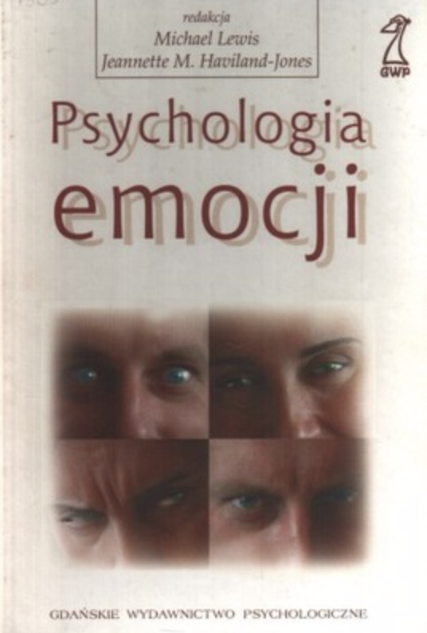

### Podstawowe info

### Kontakt

- Krzysztof Basiński
- <k.basinski@gumed.edu.pl>

### Plan zajęć

- 45h wykładów (piątki, 12:15-14:30)
- 15h ćwiczeń (Justyna Urbańska-Grosz)

### Reguły gry

- Dwa kolokwia na wykładach i egzamin końcowy
- Z kolokwiów można zdobyć 25, z egzaminu 50 punktów
- Odzywajcie się na wykładach! (dodatkowe punkty za ogólną bystrość)
- Podejść do wykładu może tylko ten, kto zaliczył ćwiczenia

### Forma kolokwiów i egzaminu

- Pytania zamknięte (ok. 80%)
- Pytania otwarte (ok. 20%)

## Poprawa kolokwiów

- Jeśli masz łącznie x <= 30 punktów z obu kolokwiów, **możesz** poprawiać
- Jeśli masz łącznie x <= 10 punktów, **musisz** poprawiać
- Poprawa na ostatnim wykładzie

### Literatura

### Niedenthal & Ric

### Niedenthal & Ric

Niedenthal, P. i Ric, F.  (2017). Psychology of Emotion. New York: Routledge.

### Strelau & Doliński

### Strelau & Doliński

Maruszewski, T., Doliński, D., Łukaszewski, W., i Marszał-Wiśniewska, M. (2008). Emocje i motywacja. W: J. Strelau & D. Doliński (Red.), Psychologia akademicka. Tom 1 (str. 511–650). Gdańskie Wydawnictwo Psychologiczne.

### Lewis & Haviland-Jones

### Lewis & Haviland-Jones

Lewis M., Haviland-Jones J.M. Psychologia emocji, GWP, Gdańsk, 2005.Łosiak W. Psychologia emocji, Warszawa, 2007.

### Sapolsky

### Sapolsky

Sapolsky, R. M. (2004). Why Zebras Don’t Get Ulcers: The Acclaimed Guide to Stress, Stress-Related Diseases, and Coping. Henry Holt and Company.

### Plan wykładów

- Definicje emocji, teorie emocji
- Indukcja i pomiar emocji
- Emocje a biologia
- Funkcje emocji
- Ekspresja emocji
- Regulacja emocjonalna

### Plan wykładów

- Uniwersalia, różnice indywidualne i kulturowe w emocjach
- Emocje a procesy poznawcze
- Stres
- Specyfika wybranych emocji
- Psychologia motywacji

