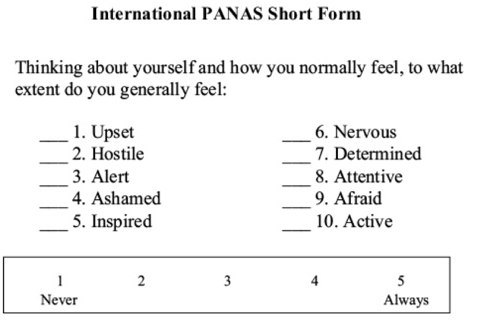
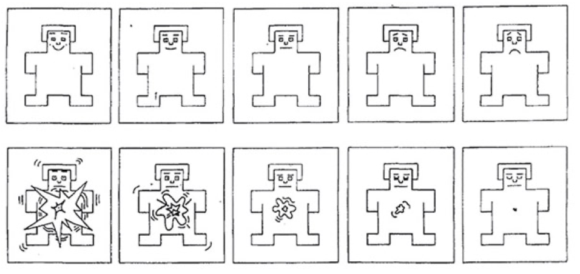
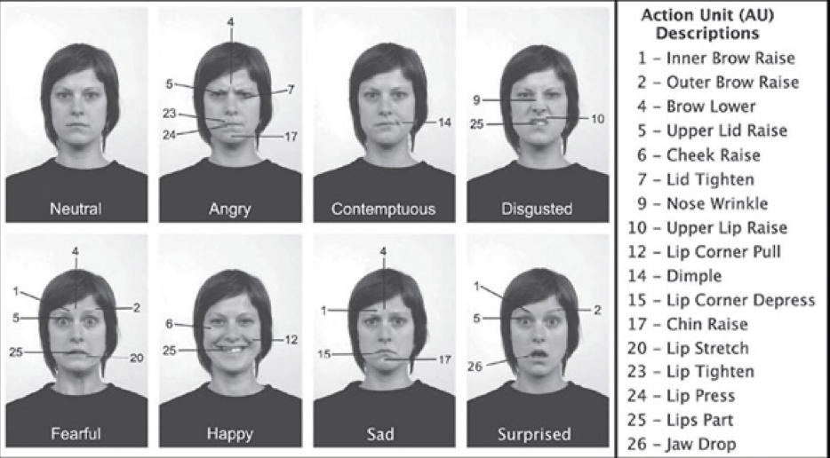
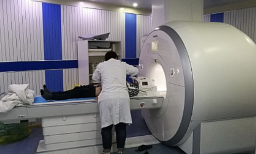
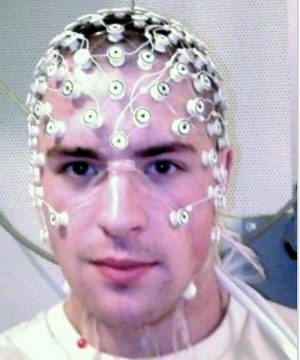
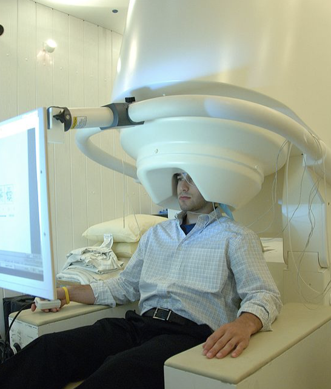
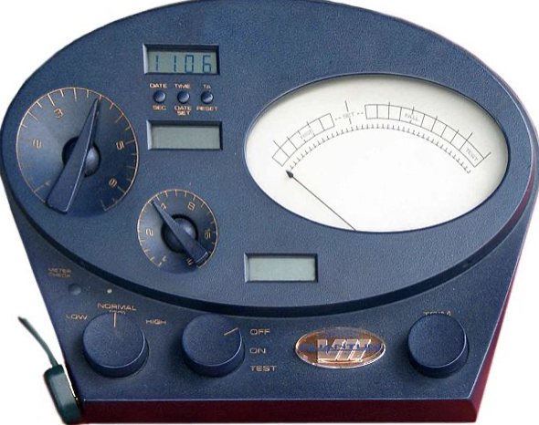
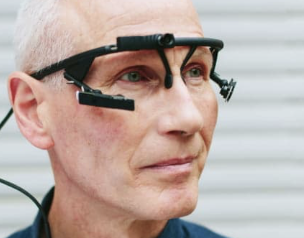
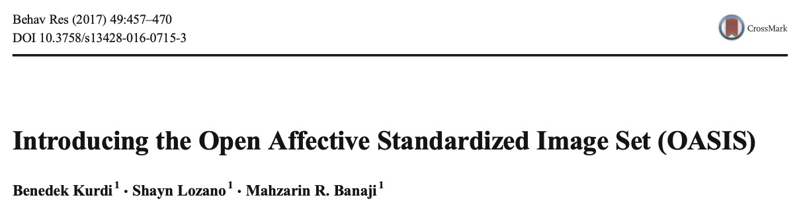
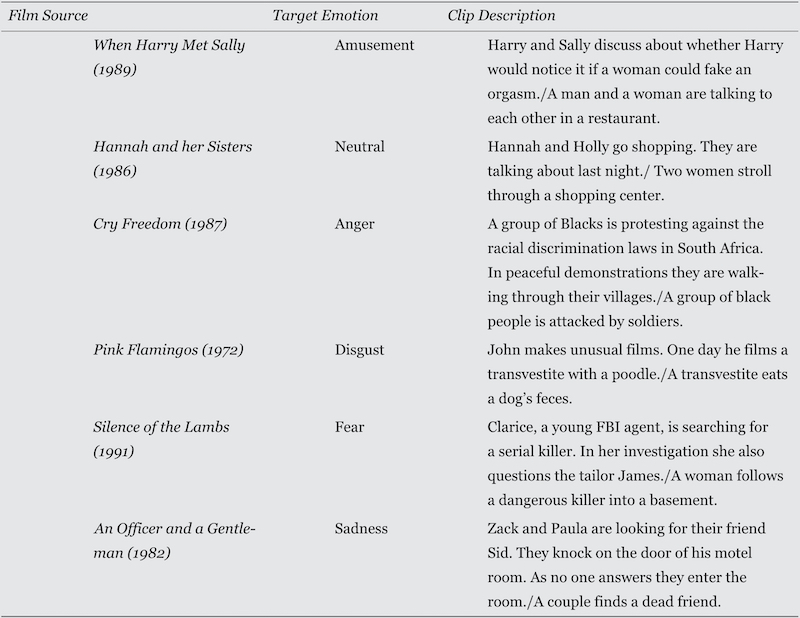

# Pomiar emocji

---

# Pomiar emocji

* Kwestionariusze
* Ekspresja mimiczna
* Obrazowanie CUN
* Obwodowy układ nerwowy i miary fizjologiczne

---

# Kwestionariusze

* PANAS (Positive and Negative Affect Schedule)
* Self-Assessment Manikin

---

# PANAS

* 10/20 słów opisujących emocje
* "Do jakiego stopnia, generalnie, czujesz się..."
* Likert 1-5
* Skala pozytywnego afektu, skala negatywnego afektu
* W polskiej adaptacji: *SUPIN * Skala uczuć pozytywnych i negatywnych* (P. Brzozowski)

---

---

# SAM

* Metoda niewerbalna
* Badany wybiera dwa obrazki odzwierciedlające *core affect*

---

# SAM

---

# Skale do Pomiaru Nastroju i Sześciu Emocji 

* Wojciszke & Baryła
* Skala Nastroju Ogólnego składa się z 10 twierdzeń sformułowanych w taki sposób, by wyrażały ogólny nastrój pozytywny lub negatywny, choć nie specyficzne emocje. 
* Likert 1-5
* 10 pozytywnych przymiotników, 10 negatywnych przymiotników

---

# Skale do Pomiaru Nastroju i Sześciu Emocji 

 * Kwestionariusz Emocji składa się z 24 przymiotników oznaczających nazwy dyskretnych emocji, po cztery na każdą z sześciu emocji głównych

---

# Ekspresja mimiczna

* Facial Action Coding System (FACS)
* Systemy automatyczne
* Sędziowie

---

# FACS

* Przeszkoleni eksperci kodują skurcze mięśni według ustalonego schematu
* Bardzo pracochłonna metoda (100 godzin szkolenia, godzina kodowania na minutę zachowania)
* Pracę nad automatyzacją trwają (Computer Expression Recognition Toolbox, CERT; FAST-FACS)

---

# FACS

---

# Sędziowie

* Założenie : ludzie potrafią trafnie rozpoznawać emocje innych ludzi
* Standardowy paradygmat sędziów kompetentnych
* Często używane w badaniach nad uniwersalnością kulturową

---

# Obrazowanie CUN

* fMRI
* EEG, ERP
* MEG

---

---

---

---

# Obwodowy układ nerwowy

* Aktywność elektrodermalna
* Tętno, ciśnienie krwi
* Szerokość źrenicy
* Mruganie

---

# Aktywność elektrodermalna

* Inaczej: odpowiedź skórno-galwaniczna (GSR)
* Pomiar przewodnictwa elektrycznego powierzchni skóry
* Powiązana z reakcją współczulną (choć nie wprost)
* Zdziwienie, pobudzenie

---

(Church of Scientology, Mark Super VII Quantum E-meter)

---

# Tętno, ciśnienie krwi

* Rzetelna rejestracja za pomocą EKG
* Strach, gniew, koncentracja uwagi, stres

---

# Szerokość źrenicy i mruganie

* Pupilometria, Eye-tracking
* Pobudzenie, aktywność współczulna, zmęczenie, stres
* Locus ceruleus

---

---

# Eksperymentalna indukcja emocji

---

# Kwestie etyczne

* Kodeksy APA, PTP, NCN...
* Naukowcy nie powinni indukować emocji o intensywności wyższej  niż w codziennych sytuacjach życiowych
* Interwencje również powinny przypominać sytuacje z codziennego życia
* Debriefing, zwłaszcza w przypadku negatywnych emocji

---

# Problemy etyczne

Przykład badania z lat 50-tych (nie róbcie tego w domu! Ax et al. 1953):

* Badani podłączani byli do generatora szoków elektrycznych
* W czasie trwania badania generator nagle zaczynał dymić a eksperymentator z przerażeniem biegał w kółko (strach)
* W innym warunku eksperymentator przez 5 minut obrażał badanego (gniew)

---

# Afektywne obrazy - IAPS

* International Affective Picture System (IAPS)
* Zestaw zdjęć i obrazów nacechowanych emocjonalnie
* Mniej więcej połowa zawiera sceny z ludźmi

---

# Afektywne obrazy -  IAPS

* Normy na pobudzenie i walencję
* Dostęp za darmo, ale trzeba poprosić o zgodę (i mieć PhD i obiecać, że się nie będzie rozpowszechniało materiałów)

---

# IADS

* 168 nacechowanych afektywnie dźwięków
* Bodźce po 6 sekund
* Oceny arousal, valence i dominance (?)

---

# OASIS

---

# OASIS

* Open Affective Standardized Image Set
* Otwarty dostęp <http://www.benedekkurdi.com/#oasis>

---

# Afektywne filmy

(Philippot, 1993; Gross, Levenson, 1995; Hewig et al. 2005)

---

---

# Jeśli chcemy aby emocje zostały na dłużej...

* _Przypomnij sobie pewne wydarzenie ... jakie emocje wtedy czułeś? Przypomnij je sobie bardzo dokładnie. Postaraj się poczuć je jeszcze raz_
* Problem - nie mamy gwarancji, że badany faktycznie poczuje daną emocję

---

# Muzyka

* Bardzo skuteczny silny sposób indukcji emocji
* Problem - indywidualne preferencje i skojarzenia słuchaczy
* Rozwiązanie - wykorzystanie muzyki nieznanej

---

# Muzyka

* Soundtracks (N = 110; < 30 s) (Eerola & Vuoskoski, 2011)
* Experimental Music (Emusic) (N = 140, 6 s),  (Fan et al., 2017)
* Natural History of Song (NHS) (N = 118, 14 s) (Mehr et al., 2018)
* Emotional Analysis of Music (EmoMusic) (N = 744, < 30 s) (Soleymani et al., 1999)

---

# Zaplanowane interakcje społeczne

* Można zrobić pod czujnym nadzorem komisji bioetycznych
* Np. procedura Stemmlera (1997/2001)

---

# Indukcja gniewu

* Pomiar elektrofizjologiczny (gsr, bp, emg)
* Badani odliczają w dół od 18652 co 7 przez 1 minutę
* Eksperymentator na nagraniu wściekły, że badany się rusza, robi artefakty, za cicho liczy
* Komentarze coraz bardziej krytyczne i wrogie
* Po trzech próbach badany słyszał, że to co zrobił jest bezużyteczne i będzie musiał powrócić do zadania później

---

# Zaplanowane interakcje społeczne

* Indukcja poczucia winy: aparat Brocka i Beckera (1966) psuł się w wyniku działania osoby badanej. 
* Na dodatek eksperymentator mówił: _"co się stało? Teraz już nigdy nie zrobię magisterki... Co zrobiłeś? Cóż, chyba skończymy eksperyment, aparat się popsuł..."_

---

# Zaplanowane interakcje społeczne

* Indukcja wstydu, Apsleer (1975): 
	* Tańcz do muzyki rockowej przez minutę 
	* Śmiej się przez 30 sekund jak g dybyś usłyszała super-śmieszny dowcip
	* Zaśpiewaj Hymn Państwowy a'capella
	* Udaj, że jesteś 5-latkiem mającym napad złości ponieważ nie chce się położyć do łóżka przez 30 sek.

---

# Naturalnie występujące emocje

* Quasi-eksperymenty i eksperymenty w warunkach naturalnych, np.:
	* zgubiony bagaż na lotnisku
	* obejrzenie emocjonalnego filmu w kinie
	* wesele 

---

# Naturalnie występujące emocje

* Experience-sampling (coś jak metoda dzienniczków): o różnych porach aplikacja na telefonie/zegarku "woła" o podanie stanu afektywnego
* Może "wołać" w losowych porach albo w konkretnych sytuacjach (np. badany wszedł do sklepu, do pracy itd.)

---

# Którą metodę wybrać?

Do rozważenia:

* Wymogi sytuacji eksperymentalnej
* Standaryzacja
* Poziom skomplikowania i trafność ekologiczna
* Wszystko ma swoje wady i zalety

---

# Wymogi sytuacji eksperymentalnej

* Czy badany potrafi łatwo odgadnąć, że jego emocje są manipulowane?
* I jeśli tak... czy to jest *big deal*?
* Warto jest czasem użyć *cover story* ?(uwaga! to nie to samo co oszukiwanie badanych!) np. mówiąc, że badanie to tak na prawdę dwa niezależne eksperymenty

---

# Standaryzacja

* Czy wiemy, że nasza metoda indukcji emocji jest trafna i rzetelna?
* Trafna, tj. czy indukuje taką emocję, jaką chcemy
* Rzetelna, tj. czy robi to podobnie u większości ludzi

---

# Poziom skomplikowania i trafność ekologiczna

* Czy interwencja jest podobna do prawdziwego życia?
* Czy nie jest zbyt "zamieszana"?
* Czy metoda uruchamia procesy obecne w prawdziwym życiu?

