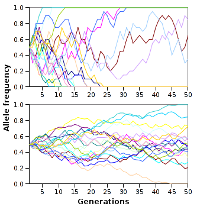
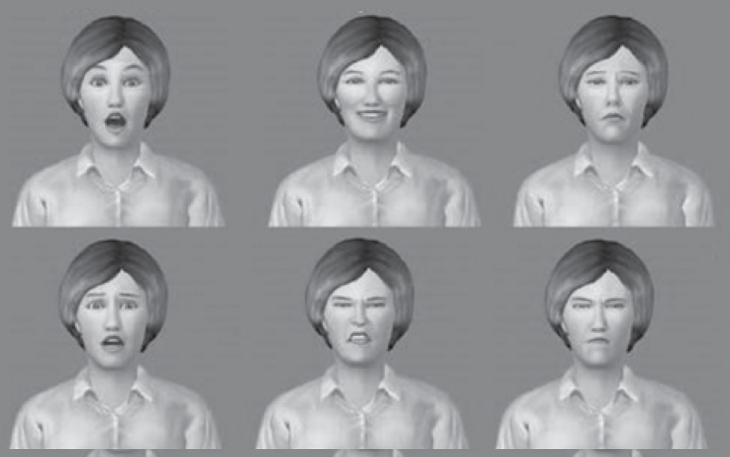
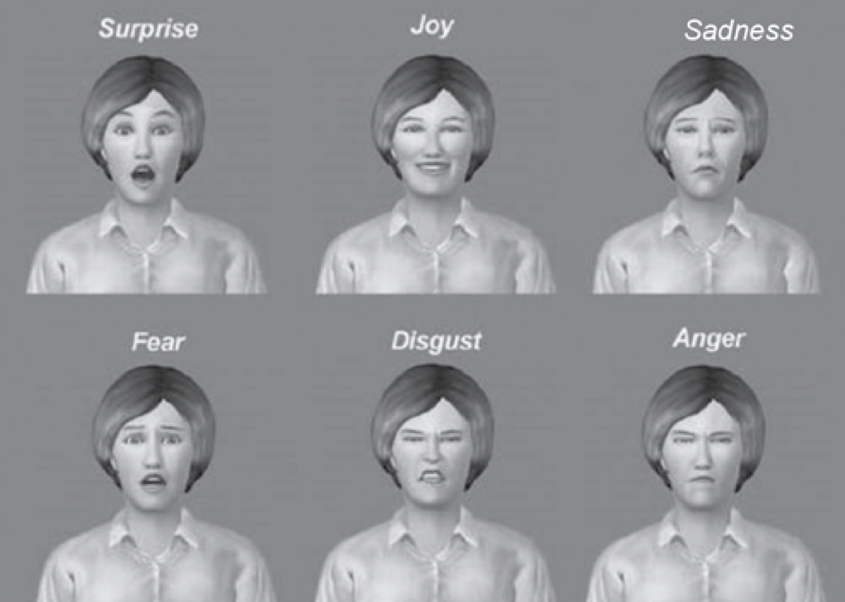
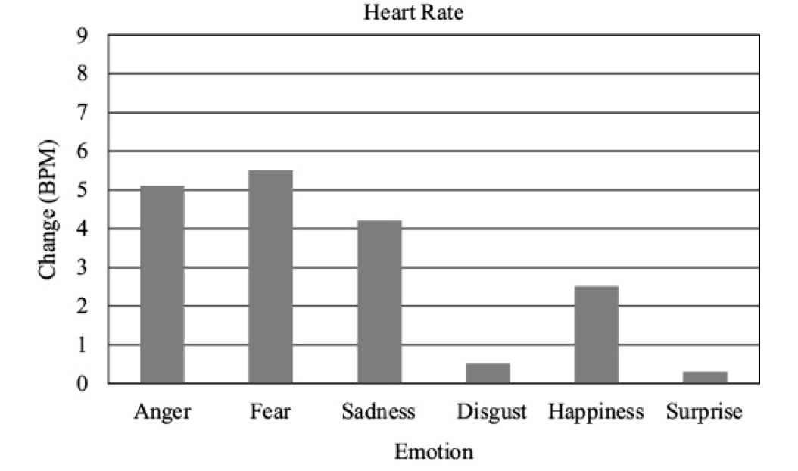
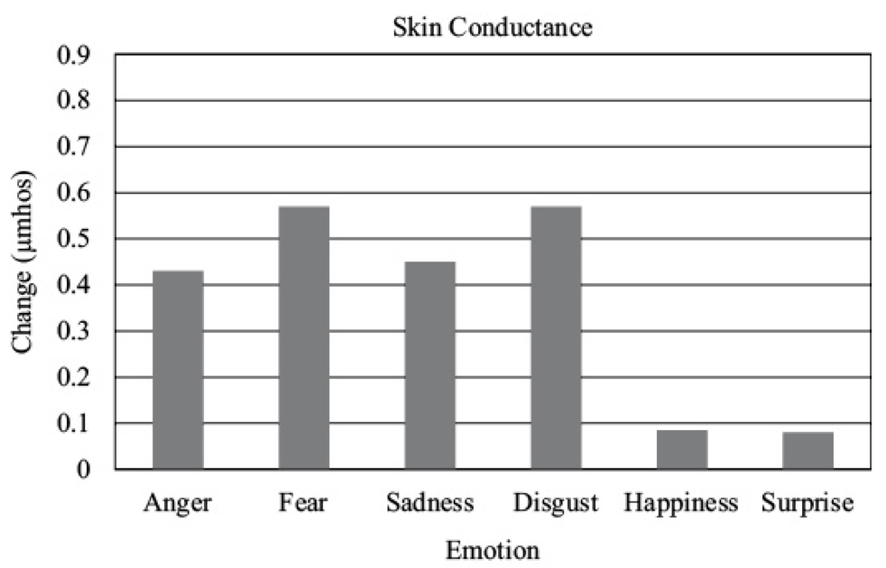

## Teorie współczesne

## Teorie współczesne

- Teorie ewolucyjne
- Teorie oceny (appraisal)
- Psychologiczny konstrukcjonizm

## Teoria ewolucji - powtórka

## Ewolucja - podstawowe mechanizmy

- Selekcja naturalna
- Selekcja seksualna

## Selekcja naturalna

- Cechy organizmu, które zwiększają jego szanse na **sukces reprodukcyjny (RS)**, są zachowane w trakcie ewolucji
- Cechy, które nie zwiększają szans na RS, nie są zachowane

## Selekcja naturalna

- Cechy zwiększające szanse na reprodukcję są najczęściej dobrze dopasowane do środowiska (*fitness*)
- Teoria ewolucji zakłada, że **środowisko** wywiera zasadniczy wpływ na kształtowanie organizmów

## Samolubne geny (Dawkins)

- To co podlega selekcji i replikacji, to tak na prawdę **geny**, a nie organizmy
- Geny, które będą się skutecznie replikować muszą:
  + replikować się wielokrotnie w ciągu życia (*fecundity*)
  + prowadzić do długiego życia, które zwiększa możliwości replikacji (*longevity*)
  + mieć wysoką jakość - replikować się dokładnie, aby geny następnych pokoleń miały niewiele błędów (*fidelity*)

## Samolubne geny (Dawkins)

Uwaga! Teza o samolubnych genach jest dość kontrowersyjna - być może lepiej analizować nie pojedyncze geny a całe fenotypy - <http://pl.wikipedia.org/wiki/Samolubny_gen>

## Jak to się ma do gatunków?

- Ewolucja nie dotyczy gatunków!
- Adaptacje nie wykształciły się po to, aby umożliwić przetrwanie gatunku!
- Podział na gatunki jest **konsekwencją** ewolucji (a tak na prawdę człowieka, który nadał organizmom etykiety!)

## Adaptacja i fitness

- Adaptacje to te cechy organizmu, które ułatwiają mu przetrwanie i reprodukcję w danym środowisku
- Adaptacje zwiększają szanse na RS
- Dostosowanie (*fitness*) dotyczy dopasowania do środowiska
- Cechy adaptacyjne zwiększają dostosowanie

## Selekcja seksualna

- Dlaczego pawie mają ogony?
- Czy pawi ogon zwiększa szanse na przetrwanie?
- Czy pawi ogon zwiększa szanse na reprodukcję?
- (dlaczego tak jest? jeśli paw może robić wszystko to co inne pawie **oraz** ma piękny ogon, pewnie ma też inne silne geny)

## Dwa warianty selekcji seksualnej

- Selekcja **interseksualna** - cechy są atrakcyjne dla płci przeciwnej (pawi ogon, szerokie ramiona, kobiece kształty)
- Selekcja **intraseksualna** - cechy zwiększające przewagę w walce o płeć przeciwną (rogi u jeleni i łosi, wojny u ludzi)

## Mechanizmy ewolucji

- Selekcja naturalna
- Selekcja seksualna
- **Dryf genetyczny** - wydarzenia "losowe" w historii genotypów
- **Spandrels** - efekty uboczne, pojawiające się w trakcie ewolucji, które nie mają roli adaptacyjnej
- Np. umiejętność czytania nie jest adaptacją ewolucyjną, została wykształcona jako skutek uboczny wykształcenia się języka, muzyka jako "słuchowy sernik" (*auditory cheesecake*) (Pinker, 1999)

## Symulacja dryfu genetycznego

## Strategie ewolucyjne

- Dobór indywidualny (dobór naturalny, dobór seksualny)
- Dobór krewniaczy (*kin selection, inclusive fitness*) 
- Altruizm odwzajemniony (*reciprocal altruism*)

## Dobór krewniaczy

- Zwiększenie szans na RS krewnych, nawet kosztem własnego RS
- Prawdopodobieństwo zachowań altruistycznych rośnie jako funkcja % wspólnych genów
- U ludzi tłumaczy dużą liczbę zachowań zupełnie altruistycznych (nie opartych na regule wzajemności) w stosunku do najbliższej rodziny

## Altruizm odwzajemniony

- Organizm A zachowuje się przez jakiś czas nieadaptacyjnie (zmniejsza swoje *fitness*), jednocześnie zwiększając *fitness* organizmu B
- A robi to, ponieważ "spodziewa się", że B zrobi podobnie w przyszłości
- Jeśli B nie odwzajemnia przysługi, A również przestaje
- Robert Trivers, lata 70te

## Dylemat więźnia

*Dwóch podejrzanych zostało zatrzymanych przez policję. Policja, rozdziela więźniów i przedstawia każdemu z nich tę samą ofertę: jeśli będzie zeznawać przeciwko drugiemu, a drugi będzie milczeć, to zeznający wyjdzie na wolność, a milczący dostanie dziesięcioletni wyrok. Jeśli obaj będą milczeć, obaj odsiedzą 6 miesięcy za inne przewinienia. Jeśli obaj będą zeznawać, obaj dostaną pięcioletnie wyroki.*

## Dylemat więźnia

*Każdy z nich musi podjąć decyzję niezależnie i żaden nie dowie się, czy drugi milczy czy zeznaje, aż do momentu wydania wyroku. Co robią?*

## Wet za wet (tit for tat)

Wet za wet to następująca strategia gry w iterowany (powtarzany) dylemat więźnia:

1. na początku współpracuj
2. potem rób dokładnie to, co przeciwnik zrobił w poprzedniej turze

## Altruizm odwzajemniony

- Bakterie to robią!
- Naczelne to robią
- U ludzi - **reguła wzajemności**

## Środowisko adaptacji ewolucyjnej

- Ang. *environment of evolutionary adaptedness (EEA)*
- Takie środowisko, dla którego wykształciły się adaptacje na drodze ewolucji
- Jeżeli środowisko szybko się zmienia, ewolucja nie nadąża

## Jakie jest EEA ludzi?

- Zbieracko-łowieckie bandy, złożone z ok. 150 osobników, w których ludzie byli dość mocno spokrewnieni ze sobą
- *"Our modern skulls house a Stone Age mind"* - Cosmides & Tooby, 1997

## Założenia psychologii ewolucyjnej

1. Organizmy są produktami selekcji naturalnej i innych procesów ewolucyjnych
2. Specyficzne cechy organizmów są więc również produktami ewolucji
3. Ludzki układ nerwowy jest ważną fizyczną cechą naszego gatunku (mózg jest najbardziej skomplikowanym ludzkim organem)

## Założenia psychologii ewolucyjnej

4. Całość zachowania jest wynikiem pracy układu nerwowego
5. Ludzkie zachowanie jest więc rezultatem ewolucji

## Zachowanie z perspektywy ewolucji

- Zachowanie jest adaptacją, która u organizmów z układem nerwowym pozwala reagować na bodźce ze środowiska
- Np. trawa nie ma układu nerwowego, więc nie może uciec przed krową...
- *"Evolutionary psychology is the radical notion that human behavior is part of the natural world"*

## Pojęcia
- Selekcja naturalna (*natural selection*)
- Selekcja seksualna (*sexual selection*)
- Sukces reprodukcyjny (**RS** - *reproductive success*)
- Dziedziczność (*heritability*)
- Mutacja (*mutation*)
- Adaptacja (*adaptation*)
- Fitness

## Ewolucyjne teorie emocji

- Darwin zauważył rolę przystosowawczą ekspresji mimicznych
- Twierdził, że niektóre ekspresje mimiczne są zbliżone u różnych gatunków
- Emocje jako "przydatne nawyki" (*servicable habits*)
- Funkcja komunikacyjna

## Servicable habits - przykłady

- Obrzydzenie powoduje utrudnione przyjmowanie trującego jedzenia i wdychanie trujących substancji
- Zdziwienie powoduje poszerzenie pola widzenia (uniesienie brwi)
- Wstyd przygotowuje ciało na potencjalne ataki

## Ewolucyjne teorie emocji

- Emocje powstają w odpowiedzi na **problemy adaptacyjne**
- Emocje są wyzwalane przez **bodźce sygnałowe**
- Emocje skutkują **tendencjami do działania** (*action tendencies*)
- **Tendencja**, ponieważ organizm przygotowuje się do działania (ale niekoniecznie musi zadziałać)

## Emocje i problemy adaptacyjne (Plutchik)

|Problem | Emocja | Tendencja do działania|
|---|---|---|
|Zagrożenie| Strach | Ucieczka |
| Przeszkoda | Gniew | Destrukcja:P |
| Potencjalny partner seksualny | Radość, miłość | Zaloty, zach. seksualne |

## Emocje i problemy adaptacyjne (Plutchik)

|Problem | Emocja | Tendencja do działania|
|---|---|---|
| Trująca substancja | Obrzydzenie | Wymioty, odpychanie |
| Nagły, nowy obiekt | Zdziwienie | Orientacja |

## Emocje podstawowe

- Skoro emocje wykształciły się ewolucyjnie, powinny być uniwersalne
- ...przynajmniej niektóre
- Skąd wiemy, które?

## Emocje podstawowe - warunki

- Uniwersalna kulturowo ekspresja
- Specyficzna fizjologia
- Obecność u innych naczelnych
- Wiążą się z dokonywaniem automatycznych ocen otoczenia

---

---

## Emocje podstawowe

- Strach
- Obrzydzenie
- Gniew 
- Zaskoczenie
- Radość
- Smutek
- Zadowolenie (?)

## Emocje a pobudzenie fizjologiczne

- Czy faktycznie mamy specyficzne wzorce fizjologiczne?
- Levenson, Ekman i Friesen (1990) kazali ludziom poruszać konkretnymi mięśniami twarzy (Directed Facial Action task)
- Wywoływali w ten sposób ekspresje emocjonalne charakterystyczne dla emocji
- Powodowało to specyficzne wzorce pobudzenia

## Emocje podstawowe

*(Levenson, Ekman, Friesen, 1990)*

## Emocje podstawowe

*(Levenson, Ekman, Friesen, 1990)*

## Programy afektywne (Tomkins)

- Wszystkie komponenty emocji dzieją się jednocześnie, ponieważ są składnikami **programu afektywnego**
- Programy afektywne to wrodzone, mózgowe wzorce reakcji emocjonalnych
- Programy sterują pobudzeniem fizjologicznym, ekspresją mimiczną, być może treściami poznawczymi

## Problemy z teoriami ewolucyjnymi

- Nie wszystkie emocje mają bodźce sygnałowe
- Nie wszyscy reagują tak samo na te same bodźce sygnałowe
- Nie zawsze realizowane są wszystkie elementy programu afektywnego
- Brak konkluzywnych badań nad koherencją komponentów programów afektywnych