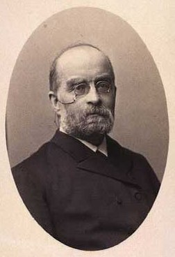

# Historia badań nad emocjami

---

# Emocje w filozofii

* Emocje od zawsze przedmiotem refleksji filozofów
* Platon, Arystoteles, Seneka, Tomasz z Akwinu, Kartezjusz, Spinoza, Hume
* Często problem emocji ma związek z _esencjalizmem_

---

# Esencjalizm

* Pogląd stary jak filozofia antyczna
* Platon - wszystkie rzeczy mają swoje idealne formy. Prawdziwe obiekty w świecie jedynie odzwierciedlają te perfekcyjne formy.
* Esencjalizm ma bardzo poważne reperkusje dla wielu dziedzin nauki (np. istota _gatunków_ w biologii, specjalizacja czynnościowa części mózgu w neuronauce itd.)
* Esencjalizm w odniesieniu do emocji zakłada, że różne emocje mają swoje **uniwersalne, idealne esencje, zrozumiałe dla każdego człowieka**

---

# Rydwan, konie i Platon

---

# Rydwan, konie i Platon

* Rydwan - rozsądek, rozum
* Biały koń - duch
* Czarny koń - popędy, emocje

---

# Teorie emocji - historia nowożytna

* Jamesa-Langego
* Cannona-Barda
* Teoria dwuczynnikowa (Schachter i Singer)

---

# Teoria Jamesa-Langego

 

---

# Teoria Jamesa-Langego

* Koniec XIX wieku
* Fizjologiczna reakcja pobudzenia jest **pierwotna**
* Emocje są konsekwencją odczuwania zmian fizjologicznych
* Różne wzorce zmian fizjologicznych powodują różne emocje

---

# Teoria J-L i niedźwiedzie

* Człowiek widzi niedźwiedzia w lesie...
* ...ma fizjologiczną reakcję na niedźwiedzia...
* ...interpretuje tą reakcję jako emocję...
* ...i ucieka!

---

# Rozwój teorii J-L

* Na przestrzeni ponad stu lat teoria J-L miała wiele form i wersji
* Np. Jamesowi przypisuje się twierdzenie, że każda kategoria emocji (gniew, strach, radość, etc.) jest powiązana z odmiennym stanem fizjologicznym
* Wg. LFB James był w rzeczywistości *przeciwny* temu twierdzeniu - uważał, że każda _instancja emocji może mieć swój wzorzec fizjologiczny_
* Nieporozumienie powstało wskutek sposobu, w jaki o teorii J-L pisał niejaki John Dewey na poczatku XX wieku

---

# Teoria Cannona-Barda

* Walter Cannon (1871–1945) fizjolog z Harvard University (przy okazji twórcja pojęcia *homeostaza*), oraz jego uczeń, Philip Bard (1898–1977)
* Zewnętrzny bodziec aktywuje receptory (np. dotyku), które są przewodzone do kory mózgowej
* Na podstawie analizy dokonywanej w korze aktywowane są wzorce ekspresji emocjonalnej

---

# Teoria Cannona-Barda

* Ta aktywacja dokonuje się we **wzgórzu** (*thalamus*)
* Różne emocje charakteryzują się różną ekspresją, ponieważ mają różne wzorce aktywacji wzgórza (w tym sensie mają swoje esencje)
* Ekspresja emocji dzieje się jednocześnie z innymi zmianami fizjologicznymi (nie jest konsekwencją pobudzenia jak w teorii J-L)

---

# Co robi wzgórze?

* "Centrala telefoniczna" - przekazuje informacje sensoryczne z obwodu do kory mózgowej
* Reguluje też kwestie związane ze spaniem/czuwaniem
* Postuluje się rolę wzgórze w podtrzymywaniu przytomności

---

# Eksperyment Schachtera i Singera

* Gr.1 -> adrenalina + informacje o jej działaniu
* Gr.2 -> adrenalina + brak info o jej działaniu
* Gr.3 -> adrenalina + nieprawdziwe informacje
* Gr.4 -> placebo

---

# Eksperyment Sch-S - manipulacje

* Grupa euforii
* Grupa gniewu

---

# Eksperyment Sch-S - wyniki

* Euforyczność w warunku euforii (od najwyższej do najniższej): adr-misinformed, adr-ignorant, placebo, adr-informed. 
* Gniew w warunku gniewu (najwyższy do najniższego): adr-ignorant, placebo, adr-informed.

---

# Teoria dwuczynnikowa Schachtera i Singera

Emocje są wynikiem: 
1. Pobudzenia
2. Etykiety opisującej to pobudzenie w danej sytuacji

---

# Teoria dwuczynnikowa Schachtera i Singera

* Pobudzenie zawsze poprzedza emocję
* Źródłem pobudzenia może być wszystko
* To samo pobudzenie może być etykietowane różnie, w zależności od oceny

