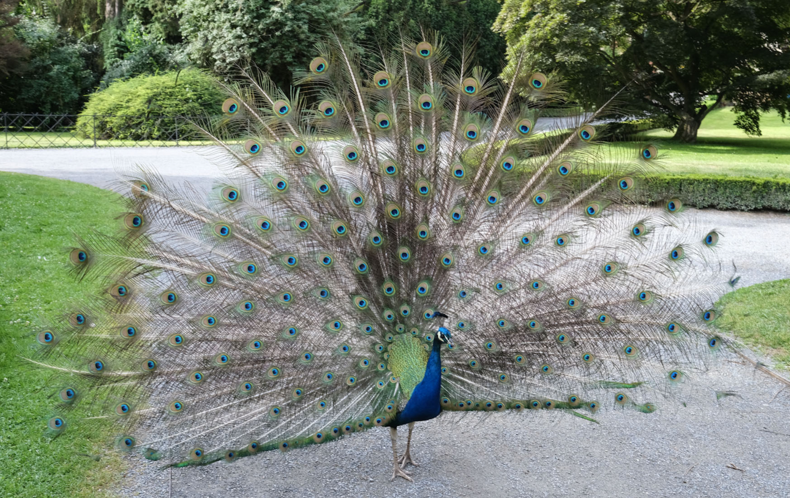

# Teoria ewolucji - powtórka

---

# Ewolucja - podstawowe mechanizmy

* Selekcja naturalna
* Selekcja seksualna

---

# Selekcja naturalna

* Cechy organizmu, które zwiększają jego szanse na **sukces reprodukcyjny (RS)**, są zachowane w trakcie ewolucji
* Cechy, które nie zwiększają szans na RS, nie są zachowane

---

# Selekcja naturalna

* Cechy zwiększające szanse na reprodukcję są najczęściej dobrze dopasowane do środowiska (*fitness*)
* Teoria ewolucji zakłada, że **środowisko** wywiera zasadniczy wpływ na kształtowanie organizmów

---

# Samolubne geny (Dawkins)

* To co podlega selekcji i replikacji, to tak na prawdę **geny**, a nie organizmy
* Geny, które będą się skutecznie replikować muszą:
  + replikować się wielokrotnie w ciągu życia (*fecundity*)
  + prowadzić do długiego życia, które zwiększa możliwości replikacji (*longevity*)
  + mieć wysoką jakość - replikować się dokładnie, aby geny następnych pokoleń miały niewiele błędów (*fidelity*)

---

# Samolubne geny (Dawkins)

Uwaga! Teza o samolubnych genach jest dość kontrowersyjna - być może lepiej analizować nie pojedyncze geny a całe fenotypy - <http://pl.wikipedia.org/wiki/Samolubny_gen>

---

# Jak to się ma do gatunków?

* Ewolucja nie dotyczy gatunków!
* Adaptacje nie wykształciły się po to, aby umożliwić przetrwanie gatunku!
* Podział na gatunki jest **konsekwencją** ewolucji (a tak na prawdę człowieka, który nadał organizmom etykiety pojęciowe!)
* Przed Darwinem rozpowszechnione w biologii było esencjonalistyczne przekonanie, że gatunki są odzwierciedleniem bytów idealnych

---

# Adaptacja i fitness

* Adaptacje to te cechy organizmu, które ułatwiają mu przetrwanie i reprodukcję w danym środowisku
* Adaptacje zwiększają szanse na RS
* Dostosowanie (*fitness*) dotyczy dopasowania do środowiska
* Cechy adaptacyjne zwiększają dostosowanie

---

# Selekcja seksualna

---

* Dlaczego pawie mają ogony?
* Czy pawi ogon zwiększa szanse na przetrwanie?
* Czy pawi ogon zwiększa szanse na reprodukcję?

---

Jeśli paw może robić wszystko to, co inne pawie **oraz** ma piękny ogon, pewnie ma też inne, "silne" geny

---

# Dwa warianty selekcji seksualnej

* Selekcja **interseksualna** - cechy są atrakcyjne dla płci przeciwnej (pawi ogon, szerokie ramiona, kobiece kształty)
* Selekcja **intraseksualna** - cechy zwiększające przewagę w walce o płeć przeciwną (rogi u jeleni i łosi, wojny u ludzi)

---

# Mechanizmy ewolucji

* Selekcja naturalna
* Selekcja seksualna
* **Dryf genetyczny** - wydarzenia "losowe" w historii genotypów
* **Spandrels** - efekty uboczne, pojawiające się w trakcie ewolucji, które nie mają roli adaptacyjnej
* Np. umiejętność czytania nie jest adaptacją ewolucyjną, została wykształcona jako skutek uboczny wykształcenia się języka, muzyka jako "słuchowy sernik" (*auditory cheesecake*) (Pinker, 1999)

---

# Symulacja dryfu genetycznego

---

# Strategie ewolucyjne

* Dobór indywidualny (dobór naturalny, dobór seksualny)
* Dobór krewniaczy (*kin selection, inclusive fitness*) 
* Altruizm odwzajemniony (*reciprocal altruism*)

---

# Dobór krewniaczy

* Zwiększenie szans na RS krewnych, nawet kosztem własnego RS
* Prawdopodobieństwo zachowań altruistycznych rośnie jako funkcja % wspólnych genów
* U ludzi tłumaczy dużą liczbę zachowań zupełnie altruistycznych (nie opartych na regule wzajemności) w stosunku do najbliższej rodziny

---

# Altruizm odwzajemniony

* Organizm A zachowuje się przez jakiś czas nieadaptacyjnie (zmniejsza swoje *fitness*), jednocześnie zwiększając *fitness* organizmu B
* A robi to, ponieważ "spodziewa się", że B zrobi podobnie w przyszłości
* Jeśli B nie odwzajemnia przysługi, A również przestaje
* Robert Trivers, lata 70te

---

# Dylemat więźnia

*Dwóch podejrzanych zostało zatrzymanych przez policję. Policja, rozdziela więźniów i przedstawia każdemu z nich tę samą ofertę: jeśli będzie zeznawać przeciwko drugiemu, a drugi będzie milczeć, to zeznający wyjdzie na wolność, a milczący dostanie dziesięcioletni wyrok. Jeśli obaj będą milczeć, obaj odsiedzą 6 miesięcy za inne przewinienia. Jeśli obaj będą zeznawać, obaj dostaną pięcioletnie wyroki.*

---

# Dylemat więźnia

*Każdy z nich musi podjąć decyzję niezależnie i żaden nie dowie się, czy drugi milczy czy zeznaje, aż do momentu wydania wyroku. Co robią?*

---

# Wet za wet (tit for tat)

Wet za wet to następująca strategia gry w iterowany (powtarzany) dylemat więźnia:

1. na początku współpracuj
2. potem rób dokładnie to, co przeciwnik zrobił w poprzedniej turze

---

# Altruizm odwzajemniony

* Bakterie to robią!
* Naczelne to robią
* U ludzi - **reguła wzajemności**

---

# Teoria gier

Matematycznym modelem zachowań altruistycznych są elementy teorii gier. Więcej tu: <https://en.wikipedia.org/wiki/Evolutionary_game_theory>

---

# Środowisko adaptacji ewolucyjnej

* Ang. *environment of evolutionary adaptedness (EEA)*
* Takie środowisko, dla którego wykształciły się adaptacje na drodze ewolucji
* Jeżeli środowisko szybko się zmienia, ewolucja nie nadąża

---

# Jakie jest EEA ludzi?

* Zbieracko-łowieckie bandy, złożone z ok. 150 osobników, w których ludzie byli dość mocno spokrewnieni ze sobą
* *"Our modern skulls house a Stone Age mind"* - Cosmides & Tooby, 1997

---

# Założenia psychologii ewolucyjnej

1. Organizmy są produktami selekcji naturalnej i innych procesów ewolucyjnych
2. Specyficzne cechy organizmów są więc również produktami ewolucji
3. Ludzki układ nerwowy jest ważną fizyczną cechą naszego gatunku (mózg jest najbardziej skomplikowanym ludzkim organem)

---

# Założenia psychologii ewolucyjnej

4. Całość zachowania jest wynikiem pracy układu nerwowego
5. Ludzkie zachowanie jest więc rezultatem ewolucji

---

# Zachowanie z perspektywy ewolucji

* Zachowanie jest adaptacją, która u organizmów z układem nerwowym pozwala reagować na bodźce ze środowiska
* Np. trawa nie ma układu nerwowego, więc nie może uciec przed krową... (choć to nie jest takie oczywiste!)
* *"Evolutionary psychology is the radical notion that human behavior is part of the natural world"*

---

# Pojęcia

* Selekcja naturalna (*natural selection*)
* Selekcja seksualna (*sexual selection*)
* Sukces reprodukcyjny (**RS** - *reproductive success*)
* Dziedziczność (*heritability*)
* Mutacja (*mutation*)
* Adaptacja (*adaptation*)
* Fitness
