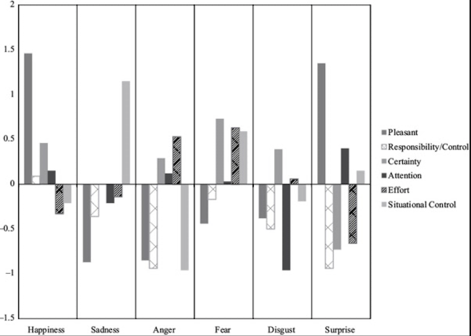

## Teorie oceny (appraisal theories)

## Kłopoty z teoriami ewolucyjnymi

- Bardzo niewiele bodźców **zawsze** powoduje emocje u **wszystkich** ludzi - bodźce sygnałowe
- To samo wydarzenie może spowodować szeroki wachlarz emocji u różnych ludzi
- Teorie oceny mają wyjaśnić nie **uniwersalność** a różnorodność ludzkiego doświadczenia emocjonalnego

## Teorie oceny

- Emocje zależą od tego, jak jednostka **oceni** sytuację
- *Appraisal is the mental process that allows you to detect objects and events in your environment and evaluate their significance for your immediate well-being* (Niedenthal & Ric)
- Jeśli wiesz jak człowiek oceni daną sytuację, możesz poznać jego emocje

## Dowody empiryczne 
- Scherer & Ceschi (1997) robili wywiady z ludźmi, którzy zgubili bagaż na lotnisku
- Im bardziej ktoś odbierał tą sytuację jako przeszkadzającą w osiągnięciu celów, tym bardziej odczuwał gniew/zaniepokojenie

## Siemer, Mauss & Gross, 2007

## Siemer, Mauss & Gross, 2007

Badani byli poddawani procedurze indukcji negatywnych emocji (Stemmler, 1997): 

- Pomiar elektrofizjologiczny (gsr, bp, emg)
- Mieli odliczać w dół od 18652 co 7 przez 1 minutę
- Trzy próby

## Siemer, Mauss & Gross, 2007

- Eksperymentator wściekły, że badany się rusza, robi artefakty, za cicho liczy
- Wszystko nagrane audio, komentarze coraz bardziej krytyczne i wrogie
- Po trzech próbach badany słyszał, że to co zrobił jest bezużyteczne i będzie musiał powrócić do zadania później

## Kategorie oceny

- Kontrolowalność 
- Istotność dla Ja
- Niespodziewaność
- Odpowiedzialność innych
- Własna odpowiedzialność

## Siemer, Mauss & Gross, 2007

- controlability (*“I felt in control of what happened during the previous task.”*)
- self-importance (*“The previous task was important to me.”*)
- unexpectedness (*“What happened during the previous task was unexpected.”*)
- other-responsibility (*“What happened during the task was the responsibility of the experimenter.”*)
- self-responsibility (*“I could have changed the way the previous task went.”*)

## Siemer, Mauss & Gross, 2007

## Wzorce oceny a emocje

## Czy ocena jest wrodzona?

- Oceny **pierwotne**: wrodzone, zdeterminowane biologicznie, szybkie, stare ewolucyjnie
- Oceny **wtórne**: korzystające z procesów "wyższego rzędu", wyuczone
- Np. widzimy węża:
	+ ocena pierwotna - zagrożenie
	+ ocena wtórna - spoko, to zaskroniec

## Kategorie oceny pierwotnej

- Nowość (*novelty*)
- Walencja

## Teorie komponentów oceny

- A może całościowe oceny nie powodują całych emocji?
- Może różne komponenty emocji są powodowane przez różne komponenty oceny?
- Np. strach ma kilka komponentów - ekspresja mimiczna, pobudzenie ANS, tendencja do ucieczki
- Każdy z tych komponentów może mieć źródło w ocenie czego innego

## Teorie komponentów oceny

- Tak można tłumaczyć "niuanse i złożoność doświadczeń emocjonalnych" (Scherer, 2009)
- Potwierdzenie empiryczne (?): ekspresje mimiczne nie korelują ściśle z subiektywnie raportowanymi emocjami (Reisenzein, Studtmann, and Horstmann, 2013)

## Problemy z teoriami oceny

- Czy ocena powoduje emocje?
- Czy może ocena tylko opisuje jakieś pobudzenie? (Teoria J-L)
- Niejasne związki między emocjami, ich ekspresją a ocenami (co robisz, gdy na pogrzebie przypomni ci się dobry dowcip?)
- Skąd biorą się różnice kulturowe w emocjach?

## Psychologiczny konstruktywizm

## Konstruktywizm

- Pytanie: dlaczego emocje "wyglądają" inaczej u różnych ludzi, pomiędzy różnymi sytuacjami i w różnych kulturach?
- Czy na prawdę jest coś takiego jak gniew, czy też jest wiele różnych doświadczeń, które *nazywamy* gniewem?
- Istotne różnice kulturowe w opisie emocji (np. w *Anuak*, jedenym z języków w Sudanie, smutek opisuje się poprzez *ciężką wątrobę*. Na Mikronezji dumę określa się "wysokim gardłem")

## Core affect

- Dwa wrodzone komponenty emocji
- Walencja (*valence*)
- Pobudzenie/aktywacja (*arousal/activation*)
- Nabywany od dzieciństwa poprzez uczenie asocjacyjne

## Core affect

- Sposób w jaki ludzie opisują swoje doświadczenia i ekspresje emocjonalne można sprowadzić do dwóch wymiarów
- Analiza czynnikowa i skalowanie wielowymiarowe

---

## Konstruktywizm

- Pomysł zasadza się na rozwinięciu idei J-L
- Dany "biologicznie" i uniwersalny jest core affect
- Emocje są konstrukcją psychologiczną opisującą core affect w kontekście poprzednich doświadczeń
- Emocje są skutkiem uczenia się przez asocjacje oraz kategoryzacji

## Konstruktywizm

- Różnice indywidualne w zmianach core affect skutkują różnicami w doświadczaniu emocji
- Różnice kulturowe w doświadczeniach emocjonalnych wynikają z różnic w procesie kategoryzacji i uwarunkowań językowych