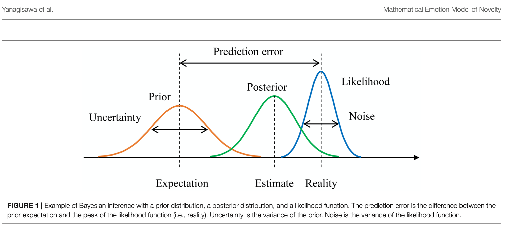

### Układanka

- Ewolucjonizm
- Kwestie historyczne
- Allostaza i procesy fizjologiczne
- Inferencja Bayesowska
- Przetwarzanie predykcyjne
- Core affect i interocepcja
- Pojęcia, kategorie i ich tworzenie

### Krótka historia kognitywistyki

### Behawioryzm

- B.F. Skinner i gołębie
- S -> R

### Rewolucja poznawcza

- Noam Chomsky - _Review of B.F.Skinner's Verbal Behavior_ (1959)
- George Miller - _The Magical Number Seven, Plus or Minus Two_
- Psychologia, lingwistyka, informatyka, filozofia i neuronauka w jednym (!?!@#!%$!)
- Metafora komputera
- Modularność umysłu, modularność mózgu
- Specjalizacja funkcjonalna mózgu

### 3E Cognition

- **E**mbodied
- **E**nactive
- **E**xtended

### Embodied cognition (ucieleśnione poznanie)

- Człowiek poznaje świat całym ciałem, nie tylko układem nerwowym
- Praca układu nerwowego jest nierozerwalnie złączona z ciałem
- Mózg jest zamknięty w czarnej skrzynce, jego interakcje ze światem zależne są od ciała

### Enactive cognition (enaktywne poznanie)

- Działanie jest nierozerwalnie związane z poznaniem
- Podmiot poznający zawsze działa, porusza się w świecie, aktywnie pozyskując informacje
- Percepcja jest w dużej mierze zależna od ciała i jego ruchu
- Postrzegamy obiekty w kategoriach działań, które możemy na nich wykonać (affordances, Gibson)
- Pojęcia powstają w kontekście działania

### Extended cognition (rozszerzone poznanie)

### Extended cognition (rozszerzone poznanie)

- Andy Clark i David Chalmers (1998)
- Jakaś część naszego systemu poznawczego jest całkowicie poza naszym ciałem
- Książki, notesy, komputery, smartfony
- Wikipedia?
- Być może poznanie jest "partnerstwem" pomiędzy mózgiem i światem zewnętrznym?

### Homeostaza i allostaza

> Na podstawie: Peter Sterling (2004), _Principles of Allostasis: Optimal Design, Predictive Regulation, Patophysiology and Rational Therapeutics_. W: Allostasis, Homeostasis, and the Costs of Physiological Adaptation. Jay Schulkin (Ed.). Cambridge University Press.

### Homeostaza

- Claude Bernard, Walter Cannon, przełom XIX i XX w.
- Celem fizjologii jest utrzymywanie stałych warunków wewnątrz organizmu
- Optymalna temperatura, ciśnienie krwi, stężenie glukozy, gospodarka sodowo-potasowa itd.
- Zachwianie homeostazy powoduje uruchomienie sprzężeń zwrotnych 

### Problem z homeostazą

### Ciśnienie krwi

- 110/70 to nie poziom optymalny tylko **średni**
- Odzwierciedla poziom najczęstszy ale nie najbardziej optymalny
- Większe zapotrzebowanie na tlen (np. z powodu wysiłku) wymaga wyższego ciśnienia

### Allostaza

- Celem fizjologii nie jest zachowanie stałych parametrów tylko zwiększenie szansy na sukces reprodukcyjny
- Parametry fizjologiczne fluktuują, ale nie z powodu zachwiania homeostazy
- Fluktuacje służą optymalizacji
- Allostaza: **coordinated variation to optimize performance at the least cost** (Sterling, 2004)
  
### Zasady allostazy

1. Organizmy są wydajne
2. Wydajność wymaga wzajemnych "poświęceń" (_reciprocal trade-offs_)
3. Wydajność wymaga przewidywania potrzeb
4. Przewidywanie wymaga dostrojenia sensorów do spodziewanych bodźców
5. Przewidywanie wymaga dostrojenia efektorów do spodziewanego zapotrzebowania
6. Regulacja predyktywna zależy od zachowania, które również podlega adaptacji

### Organizmy są wydajne

- Systemy fizjologiczne muszą być wydajne aby dobrze działać w większości prawdopodobnych sytuacji
- Zbyt duża wydajność (odporność na bardzo nieprawdopodobne, ekstremalne warunki) powoduje za duże koszty utrzymania
- Zbyt mała wydajność (brak odporności na prawdopodobne zdarzenia) jest w oczywisty sposób bez sensu

### Wydajność wymaga wzajemnych poświęceń

- _Reciprocal trade-offs_
- Poszczególne systemy/organy mogą dzielić się zasobami
- W czasie spoczynku zapotrzebowanie mięśni szkieletowych na krew to 1,2 l/min
- W czasie 100% wysiłku rośnie do 22l/min
- Nerki chwilowo dostają mniej krwi, żeby zaspokoić zapotrzebowanie mięśni
- To wymaga **centralnego sterowania**!

### Wydajność wymaga przewidywania potrzeb

- Reagowanie na zachwiania równowagi jest niewystarczające i zbyt kosztowne
- Optymalnie jest **przewidywać** potrzeby i reagować na nie
- Osoba z cukrzycą zrobi sobie zastrzyk z insuliny **przed** posiłkiem
- Naczelną funkcją mózgu jest **przewidywanie przyszłych stanów** w celu optymalizacji metabolicznej

### Więcej o allostazie i zdrowiu

### Statystyka Bayesowska

### Zagadka

- Spotykasz studenta na kampusie, zaczynacie rozmawiać
- Okazuje się, że nazywa się Tomek i jest bardzo nieśmiały
- Co robi Tomek? 
- Studiuje prawo?
- Robi dr z matematyki?

### Zagadka

- Ile jest **w ogóle** studentów prawa na kampusie?
- Ile jest **w ogóle** ludzi robiących phd z matmy na kampusie?

### Inferencja Bayesowska

$$ P(A \mid B) = \frac{P(B \mid A) \, P(A)}{P(B)} $$

### Inferencja Bayesowska

### Bayesian Brain Hypothesis

- W wielu zadaniach ludzki system poznawczy zachowuje się bayesowsko
- Być może inferencja bayesowska jest implementowana w układzie nerwowym
- _Free energy principle - every living organism aims to maximize the bayesian model evidence_ (Friston)

---

---

---

---

---

---

### PP

- Predictive processing (przetwarzanie predykcyjne)
- Predictive coding (kodowanie predykcyjne)
- Active inference (aktywne wnioskowanie)

### Herman von Helmholtz (1821 - 1894)

### Rao & Ballard, 1999, Nat Neurosci

### Karl Friston

### PP - o co chodzi?

Percepcja jest kombinacją:

- **Predykcji** opartych na wiedzy (_prior_)
- Danych sensorycznych potwierdzających (lub nie) te predykcje (_likelihood_)

### PP - o co chodzi?

Percepcja jest kombinacją:

- procesów **wstępujących** (bottom-up)
- procesów **zstępujących** (top-down)

### Percepcja to kontrolowana halucynacja

- Wykorzystujemy probabilistyczną wiedzę, żeby tworzyć **generatywny model świata**
- Model ten wykorzystujemy do **konstruowania** doświadczeń percepcyjnych

### Mózg jako maszyna do tworzenia predykcji

- Mózg (UN) to wielowarstwowe, wieloośrodkowe, hierarchiczne urządzenie, które non-stop zajmuje się **przewidywaniem własnych stanów sensorycznych** (eksterocepcji, interocepcji, propriocepcji)
- To co widzimy w danym momencie to **najbardziej prawdopodobna predykcja na temat najbliższej przyszłości**

### Hierarchiczność w PP

- _Wyższe_ struktury cały czas starają się przewidzieć stany _niższych_ struktur
- Najniższe poziomy hierarchii: neurony narządach sensorycznych, drogi sensoryczne
- Wyższe poziomy: percepcja obiektów, kategorie pojęciowe, stany motywacyjne, etc

### Hierarchiczność (Lupyan & Clark, 2015)

### Błędy predykcji (prediction errors)

- Jeśli stany sensoryczne zgodne są z modelem/przewidywaniami: wszystko jest ok
- Jeśli nie: powstają błędy predykcji, które uaktualniają model tak, by lepiej przewidywał stany
- To jest **uczenie się**

### Precyzja

- _Self-estimated sensory uncertainty - precision_
- Błędy predykcji mogą wynikać z różnych przyczyn
- W nocy widzimy mniej niż w dzień
- Mózg zdaje sobie sprawę z niepewności związanej z błędami predykcji
- Im większa niepewność/mniejsza precyzja, tym błędy mają mniejszą szansę wpłynąć na model generatywny

### Przykład (LFB)

- Jesteś policjantem, idziesz ciemną ulicą w kiepskiej dzielnicy
- Widzisz człowieka wyjmującego komórkę z kieszeni
- PP tworzy model biorąc pod uwagę: bycie policjantem, ciemność, kiepska dzielnica, ktoś sięga do kieszeni...
- W tej sytuacji może stworzyć się **wyraźny percept** broni (_shooter bias_)

### Precyzja a uwaga

- W PP ten mechanizm utożsamiany jest z **uwagą**
- Jeśli kierujemy na coś uwagę, zwiększamy precyzję błędów predykcji
- Zwiększając precyzję, zwiększamy szansę na zmianę modelu świata

### PP to nie tylko percepcja

- PP sugeruje, że tworzenie modeli jest naczelną zasadą organizującą systemy biologiczne!
- W tym sensie aplikowane jest do wszystkich obszarów funkcjonowania umysłu

### PP to nie tylko teoria! 

- PP to zasada, wg. której skonstruowane są układy nerwowe!
- Mózgi ssaków mają architekturę, która pozwala na PP (mają?)

### Predykcje w życiu

200km/h!

### Proste przykłady

### Proste przykłady

<https://michaelbach.de/ot/mot-flashLag/index.html>

### Działanie (action)

### Klasyczny pogląd na działanie (D.Hume)

Aby działać, potrzebne są:

- Przekonania na temat świata (_beliefs_)
- Pragnienie, aby zmienić ten świat (_motivation_)

### PP a działanie

Gdy model się nie zgadza z danymi sensorycznymi, można:

- Zmienić model, by pasował do świata
- Zmienić świat, by pasował do modelu

### PP a poruszanie się (motor control)

- Gdy chce się poruszyć, wytwarzam model świata, w którym już się poruszyłem
- Model odbiega od rzeczywistości (błędy predykcji!)
- Ruszam się, żeby dopasować model (zmniejszyć błąd)
- (można tak programować roboty!)

### Ale po co w ogóle się ruszać?

- PP zakłada hierarchiczność systemu
- Pragnienia "długoterminowe" (motywacje?) są wynikami długoterminowych, wysokopoziomowych predykcji na temat własnego stanu w przyszłości

### Przykład (A.Clark)

- _Przewiduję, że_ spotkamy się o 19:00 w kinie, więc...
- _Przewiduję, że_ wsiądę do autobusu o 18:30, więc...
- _Przewiduję, że_ poruszę moimi kończynami, żeby dojść na przystanek, itd.

### Od PP do free energy principle

### Od PP do free energy principle

<https://www.youtube.com/watch?v=NIu_dJGyIQI&t=12s>

### Problemy z PP

- Teoria wszystkiego?
- Falsyfikowalność?
- Czy PP to wszystko, czy jest coś jeszcze?
- Czy PP tłumaczy celowość, moralność, inne ludzkie przywary?
- Czy free energy principle się zgadza?

### Jeśli kogoś to zainteresowało...

- [Anil Seth: Your brain hallucinates your conscious reality](https://www.youtube.com/watch?v=lyu7v7nWzfo)

- [Andy Clark: Happily Entangled: Emotions Cognition and the Predictive Mind](https://www.youtube.com/watch?v=OS3RM3F8YmE)

### Książki o PP

Jakob Hohwy, The Predictive Mind (2014), Oxford University Press

### Książki o PP

### PP a emocje?

### Andy Clark

### Lisa Feldman Barrett

### PP a emocje?

- Zacznijmy od pomysłu J-L (współcześnie Prinz, Damasio, etc.)
- Interocepcja jest jednym ze źródeł informacji, które wykorzystujemy do predykcji
- Interocepcja ma **wysoką precyzję**, więc jest ważna dla modelu generatywnego
- BTW, PP elegancko integruje dane z eksterocepcji

### Prymat emocji? Poznania?

- W PP emocje są skutkiem predykcji na temat przyszłego stanu, wykształconymi przez ekstero/interocepcję
- Emocje = tendencja do działania (_action tendency_)
- W tym sensie **wszystko jest powiązane** (co rozwiązuje wiele problemów!) a rozgraniczenie na emocje i poznanie traci sens