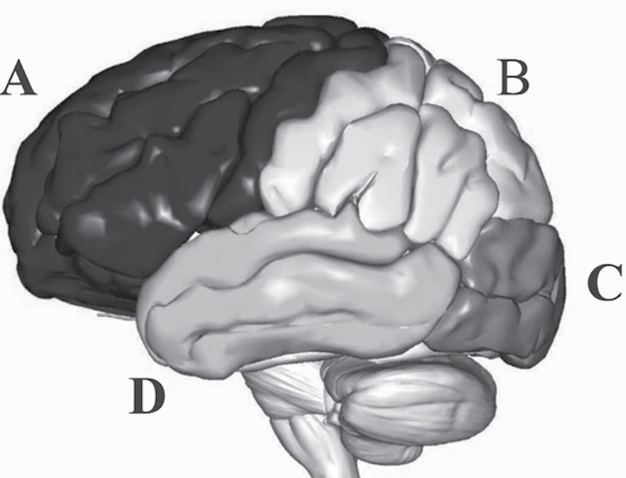
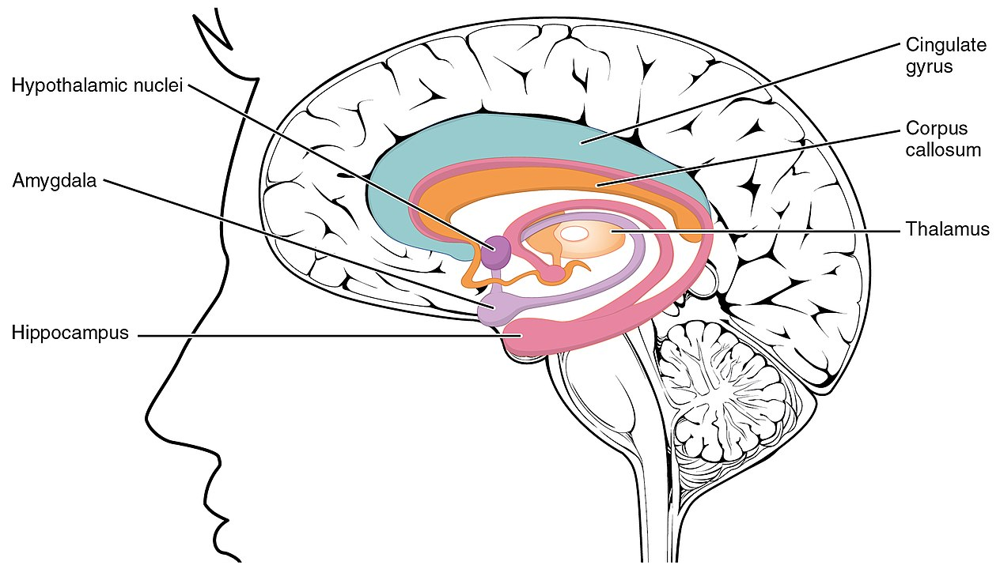

### Mózg - powtórka z rozrywki

### Centralny/ośrodkowy układ nerwowy (CNS)

- _Central nervous system_
- Mózg 
- Rdzeń kręgowy

### Mózg

- Składa się z:
	- Kory
	- Śródmózgowia (m.in. wzgórze i podwzgórze)
	- Pnia mózgu (do którego podłączony jest rdzeń)
	- Móżdżku

### Półkule i płaty

### Obwodowy ukaład nerwowy

- _Peripheral nervous system (PNS)_
- Składa się z:
	- Somatycznego układu nerwowego
	- Autonomicznego układu nerwowego (ANS)

### Autonomiczny układ nerwowy

- Dzieli się na:
	- Współczulny UN: _fight or flight_
	- Przyswpółczulny UN: _rest and digest_

### Emocje w mózgu

### Teorie historyczne

- Teoria Cannona-Barda i rola wzgórza
- Krąg Papeza (1937) jako ośrodek emocji (wzgórze, podwzgórze, hipokamp, zakręt obręczy)

### Układ limbiczny

### Teorie lokalizacyjne (_locationism_)

- Specyficzne części mózgu odpowiedzialne są za konkretne rzeczy
- Być może konkretne emocje "siedzą" w konkretnych lokalizacjach?

### Ciało migdałowate (_amygdala_)

- Pełni kluczową rolę w lęku i strachu
- Badania na zwierzętach
- Pacjent SM z obustronnym uszkodzeniem ciała migdałowatego nie odczuwa strachu (a odczuwa inne emocje)
- Większa aktywacja ciała migdałowatego u osób z indukowanym strachem w fMRI

### Wyspa (_insula_)

- Pełni ważną rolę w obrzydzeniu?
- U makaków elektryczna stymulacja wyspy powoduje ekspresję obrzydzenia
- U ludzi wyższa aktywacja wyspy przy indukcji obrzydzenia
- Pacjent z uszkodzeniem jednostronnym wyspy miał problemy z rozróżnianiem obrzydzenia i odczuwaj je rzadziej

### Inne struktury

- Przednia część zakrętu obręczy (ACC) i smutek?
- Przednia przyśrodkowa kora przedczołowa (!), OFC (Orbitofrontal Cortex) i jej rola w gniewie?

### Konstrukcjonizm

- Wydaje się, że mózg nie ma wyspecjalizowanych lokalizacji odpowiedzialnych za dane emocje (albo nie potrafimy ich znaleźć)
- Np. ciało migdałowate:
	- Nie wszyscy pacjenci z uszkodzeniem cała migdałowatego nie rozpoznają strachu
	- Być może ciało migdałowate odpowiedzialne jest za odpowiedź na zagrażające bodźce?
	- Albo za odpowiedź na ogólnie ważne bodźce?

### Konstrukcjonizm

- Zamiast tego emocje powstają na skutek działania sieci struktur mózgowych (_neural network_)
- Ta sieć składa się ze struktur limbicznych, ale też np. mPFC i struktur językowych

### A co z półkulami?

- Przecież ludzie są prawo albo lewopółkulowi!?
- Nie są!

### Hipoteza prawej półkuli

- _Emocje są przetwarzane przede wszystkim w prawej półkuli_
- Pacjenci z uszkodzeniami w prawej półkuli mieli problemy z emocjami
- fMRI i EEG nie pokazują zwiększonej aktywności prawostronnej w wyniku odczuwania emocji

### Hipoteza walencji

- _Negatywne emocje są przetwarzane z prawej a pozytwne z lewej strony_
- Dlatego pacjenci z prawostronnym uszkodzeniem mieli problemy emocjonalne
- Wada Test: chwilowa, farmakologiczna inhibicja jednej półkuli
- Wada w lewej: nastrój depresyjny
- Wada z prawej: śmiech, radość, pozytywny nastrój

### Dążenie-unikanie

- Dążenie do czegoś wynika z pracy lewej PFC
- Unikanie czegoś z prawej PFC
- To jest b. podobne do hipotezy walencji, z wyjątkiem gniewu
- Gniew jest negatywną emocją dążenia - i wiąże się raczej z aktywacją lewej półkuli

### Problemy w badaniu mózgu

- Kwestie etyczne
- Przeniesienie wiedzy z gryzoni/kotów/małp na ludzi
- Ograniczenia metod neuroobrazowania (fMRI!)
- Ograniczenia metod neuropsychologicznych