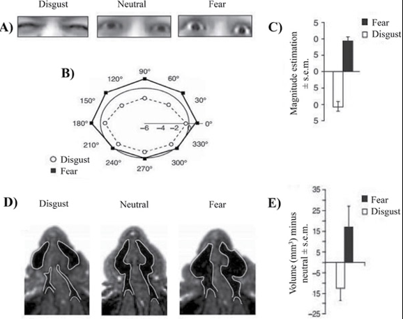
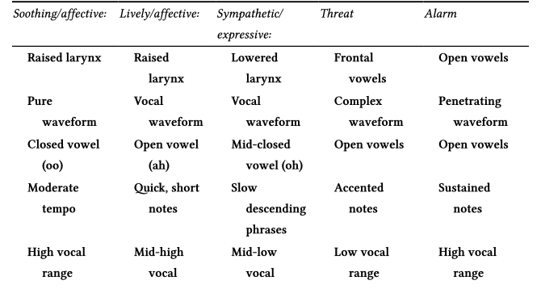

### Twarze są ważne

- Pierwsza rzecz, którą widzi dziecko po urodzeniu
- Wszędzie widzimy twarze (chmury, grzanki, plamy Rorschacha)
- Rola w komunikacji - rozbieżność języka mówionego i pisanego 
- Emotikony:
	- Uwielbiam go XD
	- Uwielbiam go :/

### Mechanika ekspresji mimicznej

- Ekspresja za pomocą skurczów 43 mięśni twarzy
- Mięśnie twarzy przyczepione do skóry, nie do kości
- Być może ludzkie twarze mają mniej włosów niż inne gatunki, żeby ułatwić ekspresję mimiczną
- Oprócz ekspresji mimicznej, mięśnie twarzy odpowiadają za ruchy organów twarzy (usta, nos, oczy, uszy)

### Mechanoreceptory na twarzy

- Mięśnie twarzy nie mają proprioreceptorów
- Tylko mechanoreceptory w skórze (wykrywające ruch) sygnalizują zmiany mimiczne
- Często ludzie "zastygają" w jakimś grymasie, nie zdając sobie z tego sprawy

### Unerwienie twarzy

- Mięśnie twarzy otrzymują sygnały z mózgu poprzez neurony ruchowe wychodzące z pnia mózgu
- Siódmy nerw czaszkowy (nerw twarzowy, _facial nerve_) - czoło, brwi, usta
- Trzeci nerw czaszkowy (nerw okoruchowy, _occulomotor nerve_) - powieki, ruchy gałki ocznej, źrenicy
- Piąty nerw czaszkowy (nerw trójdzielny, _trigeminal nerve_) - żucie, ruchy szczęki, sygnały aferentne z mechanoreceptorów

### Unerwienie twarzy

- System unerwienia dla twarzy jest znacznie bardziej skomplikowany niż dla innych części ciała
- Niektóre elementy tego systemu działają automatycznie, inne można w dużym stopniu kontrolować
- Ruchowe jądro twarzowe (? _facial motor nucleus_) w pniu mózgu dostaje info z kory ruchowej, ale też z okolic "emocjonalnych" (np. ciała migdałowatego)

### Mięśnie twarzy

- <https://www.youtube.com/watch?v=zGqfKY1rjkM>
- <https://www.youtube.com/watch?v=wQYD9ioKLqQ>

### Skąd wzięły się ekspresje mimiczne

- Czy są produktem ewolucji?
- Czy są uniwersalne kulturowo?
- Jak mają się ludzkie ekspresje do ekspresji innych zwierząt?

### Ewolucja i funkcje ekspresji mimicznych

- Darwin i przydatne nawyki
- Przydatność strachu, zdziwienia i obrzydzenia

### Przydatne nawyki

### Komunikowanie emocji u innych ssaków

- Postura
- Uszy
- Wokalizacje
- Być może u naczelnych mimika to "przerysowana" wersja ruchów potrzebnych do wokalizacji?

### Wokalizacje

- U zwierząt wyższe dźwięki są przyjacielskie lub sygnalizują uległość
- Niższe sygnalizują wrogość (niski dźwięk = duże zwierze)
- Ruch twarzy przy wydawaniu wysokich dźwięków jest inny i zbliżony do ekspresji pozytywnych emocji (u ludzi i szympansów)

### Ekspresje mimiczne naczelnych

- U szympansów zadowolenie objawia się uśmiechem połączonym z rytmicznymi wokalizacjami (coś jak śmiech) 
- Aprobata społeczna aprobata społeczna wiąże się z innym uśmiechem
- U ludzi podobnie
- Uśmiech zadowolenia dużo trudniej "udawać" niż uśmiech aprobaty

### Mimika u szympansów

<https://www.youtube.com/watch?v=yEF0z5IS5DA>

### Ekspresje mimiczne a prawdziwe emocje

- Ekspresje mimiczne odzwierciedlają faktyczny stan emocjonalny danej osoby (_read-out view_)
- Ekspresje komunikują motywy osoby (to, co zamierza zrobić). Mimika ma przede wszystkim funkcję komunikacyjną (_behavioral ecology view_)

### Ekspresje mimiczne a prawdziwe emocje

- Badania raczej wskazują na behavioral ecology
- Grając w kręgle, uśmiechamy się bardziej do ludzi niż do kręgli
- Jesteśmy "bardziej smutni", gdy otaczają nas inni ludzie

### Facial feedback hypothesis

- Nerw trójdzielny - żucie, ruchy szczęki, **sygnały aferentne z mechanoreceptorów**
- Facial feedback hypothesis (FFH) - ekspresje mimiczne wpływają na odczuwane stany emocjonalne
- Mocna wersja - ekspresje **powodują** emocje
- Słaba wersja - ekspresje **modulują** emocje
- _Put on a happy face_

### FFH - dane empiryczne

- W eksperymentalnej indukcji emocji, badani mają za zadanie:
	- Przesadnie reagować mimicznie (skutkuje zwiększeniem intensywności emocji)
	- Tłumić reakcje mimiczne (skutkuje zmniejszeniem intensywności emocji)
- Działa dla emocjonalnych filmów, szoków elektrycznych, zapachów czy wyobrażonych sytuacji
- Możliwy efekt oczekiwania ze strony badanego

### FFH - Strack, Martin i Stepper, 1988

- Badani oglądali śmieszne kreskówki trzymając długopis:
	- zębami (wspomaga uśmiech)
	- ustami (utrudnia uśmiech)
	- w dłoni (kontrola)
- Wyniki spójne z FFH
- Ale uwaga! Możliwy problem z replikowalnością!

### FFH - użyteczność kliniczna

- Pacjenci z MDD dostający zastrzyki z botoxu czuli się lepiej (Finzi i Rosenthal, 2014)
- U pacjentów z paraliżem twarzy, większy stopień paraliżu "mięśnia uśmiechu" (_zygomatic muscle_) wiązał się z wyższą intensywnością objawów depresji (VanSwearingen, Cohn, & Bajaj-Luthra, 1999). 
- Efekty istotne, ale bardzo słabe

### Ciało a ekspresja emocji 

- Emocje "widać" nie tylko na twarzy
- Zwierzęta sygnalizują emocje posturą

### Film o point light display

<https://www.youtube.com/watch?v=rEVB6kW9p6k>

### Point light display

- Wysoka zdolność rozpoznawania emocji przy braku informacji mimicznych

### Emocje w głosie

- Zwierzęta sygnalizują emocje wokalizacją
- Język pisany "uboższy" od mówionego - **prozodia mowy**
- Można badać charakterystykę akustyczną głosu

### Emocje w głosie

- Dobre powody by sądzić, że w głosie słychać pobudzenie
- Specyficzne emocje trudne do wykrycia
- Np. gniew i radość wiążą się z podobnymi zmianami wysokości i głośności głosu (dlatego, że są jednocześnie wysokim pobudzeniem?)

### Emocje w głosie

- Być może o emocjach świadczy cały zestaw cech akustycznych (_attack, jitter_, nosowość, gardłowość)
- Są to cechy trudno rozpoznawalne automatycznie, ale możliwe do rozpoznania przez wytrenowanych słuchaczy
- Być może jednym ze źródeł powstania muzyki są emocjonalne wokalizacje

### Emocje w głosie

- Można też odtwarzać głosy "zwykłym ludziom" i oceniać konsensus w rozpoznawaniu emocji
- Konsensus ten jest wysoki dla gniewu, strachu, radości, smutku, niezależnie od języka i kultury (Sauter et al., 2010)

### Afekt a cechy akustyczne wokalizacji (Snowdon & Tele, 2013)

