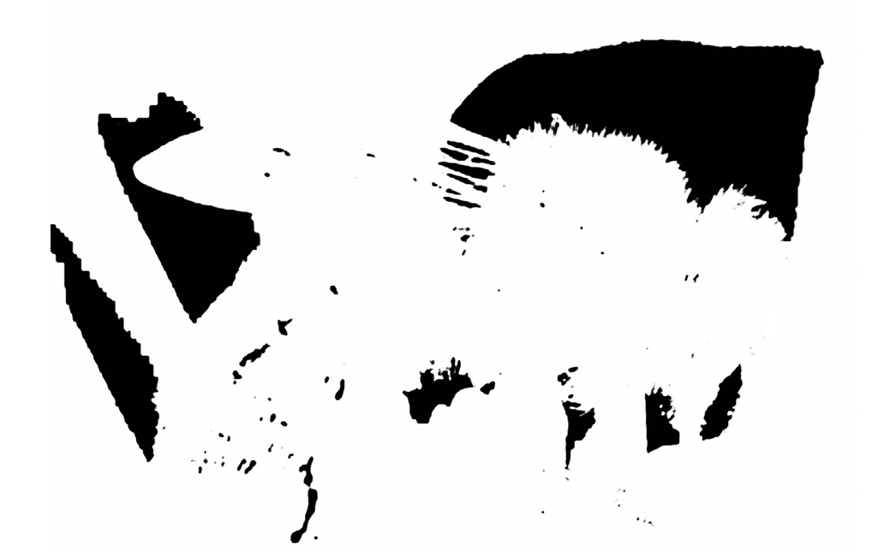
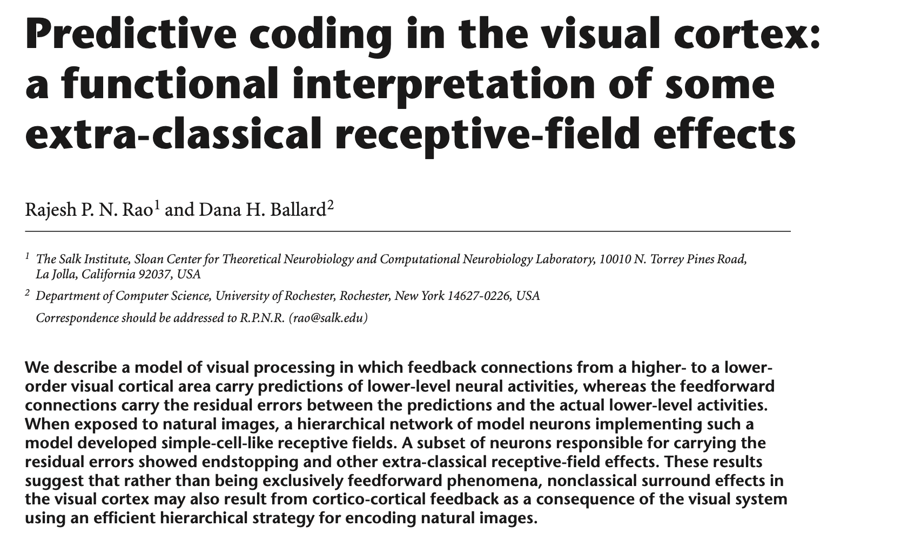
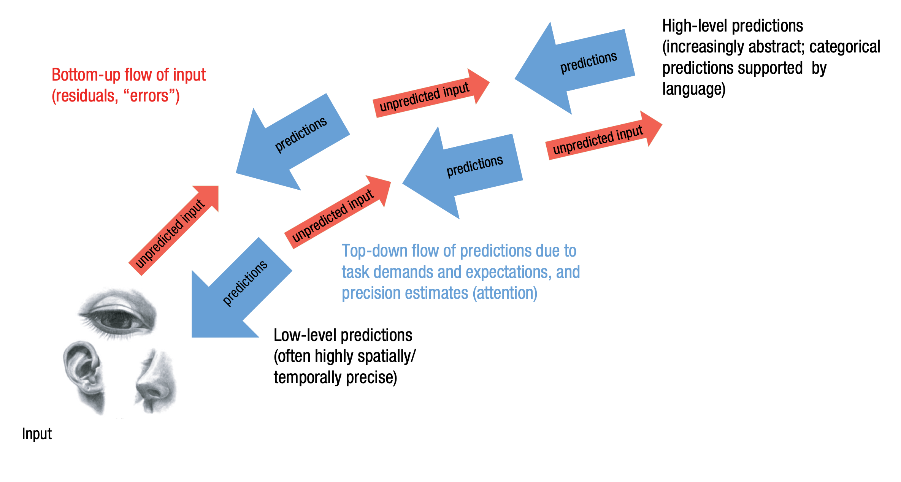

# Bayesowskie mózgi i przetwarzanie predykcyjne

---

# Zagadka

* Spotykasz studenta na kampusie, zaczynacie rozmawiać
* Okazuje się, że nazywa się Tomek i jest bardzo nieśmiały
* Co robi Tomek? 
* Studiuje prawo?
* Robi dr z matematyki?

---

# Zagadka

* Ile jest **w ogóle** studentów prawa na kampusie?
* Ile jest **w ogóle** ludzi robiących phd z matmy na kampusie?

---

# Inferencja Bayesowska

$$ P(A \mid B) = \frac{P(B \mid A) \, P(A)}{P(B)} $$

---

# Inferencja Bayesowska

---

# Bayesian Brain Hypothesis

* W wielu zadaniach ludzki system poznawczy zachowuje się bayesowsko
* Być może inferencja bayesowska jest implementowana w układzie nerwowym
* _Free energy principle - every living organism aims to maximize the bayesian model evidence_ (Friston)

---

---

---

---

---

---

---

# PP

* Predictive processing (przetwarzanie predykcyjne)
* Predictive coding (kodowanie predykcyjne)
* Active inference (aktywne wnioskowanie)

---

# Herman von Helmholtz (1821 - 1894)

---

# Rao & Ballard, 1999, Nat Neurosci

---

# Karl Friston

---

# PP - o co chodzi?

Percepcja jest kombinacją:

* **Predykcji** opartych na wiedzy (_prior_)
* Danych sensorycznych potwierdzających (lub nie) te predykcje (_likelihood_)

---

# PP - o co chodzi?

Percepcja jest kombinacją:

* procesów **wstępujących** (bottom-up)
* procesów **zstępujących** (top-down)

---

# Percepcja to kontrolowana halucynacja

* Wykorzystujemy probabilistyczną wiedzę, żeby tworzyć **generatywny model świata**
* Model ten wykorzystujemy do **konstruowania** doświadczeń percepcyjnych

---

# Mózg jako maszyna do tworzenia predykcji

* Mózg (UN) to wielowarstwowe, wieloośrodkowe, hierarchiczne urządzenie, które non-stop zajmuje się **przewidywaniem własnych stanów sensorycznych** (eksterocepcji, interocepcji, propriocepcji)
* To co widzimy w danym momencie to **najbardziej prawdopodobna predykcja na temat najbliższej przyszłości**

---

# Hierarchiczność w PP

* _Wyższe_ struktury cały czas starają się przewidzieć stany _niższych_ struktur
* Najniższe poziomy hierarchii: neurony narządach sensorycznych, drogi sensoryczne
* Wyższe poziomy: percepcja obiektów, kategorie pojęciowe, stany motywacyjne, etc

---

# Hierarchiczność (Lupyan & Clark, 2015)

---

# Błędy predykcji (prediction errors)

* Jeśli stany sensoryczne zgodne są z modelem/przewidywaniami: wszystko jest ok
* Jeśli nie: powstają błędy predykcji, które uaktualniają model tak, by lepiej przewidywał stany
* To jest **uczenie się**

---

# Precyzja

* _Self-estimated sensory uncertainty - precision_
* Błędy predykcji mogą wynikać z różnych przyczyn
* W nocy widzimy mniej niż w dzień
* Mózg zdaje sobie sprawę z niepewności związanej z błędami predykcji
* Im większa niepewność/mniejsza precyzja, tym błędy mają mniejszą szansę wpłynąć na model generatywny

---

# Przykład (LFB)

* Jesteś policjantem, idziesz ciemną ulicą w kiepskiej dzielnicy
* Widzisz człowieka wyjmującego komórkę z kieszeni
* PP tworzy model biorąc pod uwagę: bycie policjantem, ciemność, kiepska dzielnica, ktoś sięga do kieszeni...
* W tej sytuacji może stworzyć się **wyraźny percept** broni (_shooter bias_)

---

# Precyzja a uwaga

* W PP ten mechanizm utożsamiany jest z **uwagą**
* Jeśli kierujemy na coś uwagę, zwiększamy precyzję błędów predykcji
* Zwiększając precyzję, zwiększamy szansę na zmianę modelu świata

---

# PP to nie tylko percepcja

* PP sugeruje, że tworzenie modeli jest naczelną zasadą organizującą systemy biologiczne!
* W tym sensie aplikowane jest do wszystkich obszarów funkcjonowania umysłu

---

# PP to nie tylko teoria! 

* PP to zasada, wg. której skonstruowane są układy nerwowe!
* Mózgi ssaków mają architekturę, która pozwala na PP (mają?)

---

# Predykcje w życiu

200km/h!

---

# Proste przykłady

---

# Proste przykłady

<https://michaelbach.de/ot/mot-flashLag/index.html>

---

# Problemy z PP

* Teoria wszystkiego?
* Falsyfikowalność?
* Czy PP to wszystko, czy jest coś jeszcze?
* Czy PP tłumaczy celowość, moralność, inne ludzkie przywary?
* Czy free energy principle się zgadza?

---

# Jeśli kogoś to zainteresowało...

* [Anil Seth: Your brain hallucinates your conscious reality](https://www.youtube.com/watch?v=lyu7v7nWzfo)

* [Andy Clark: Happily Entangled: Emotions Cognition and the Predictive Mind](https://www.youtube.com/watch?v=OS3RM3F8YmE)

---

# Książki o PP

Jakob Hohwy, The Predictive Mind (2014), Oxford University Press

---

# Książki o PP

