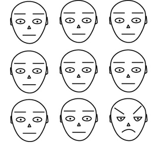
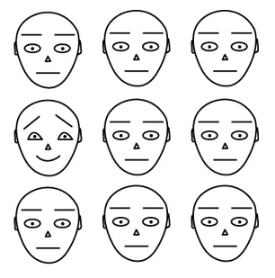
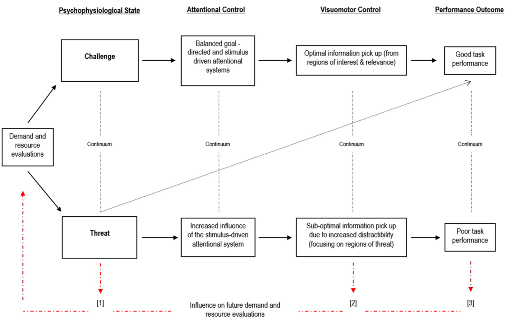

# Emocje a procesy poznawcze

---

# Emocje a procesy poznawcze

* Jakie są związki między jednym a drugim?
* Co jest "pierwotne" a co "wtórne"?
* Czy na pewno emocje i procesy poznawcze to dwie różne rzeczy?

---

# Emocje są pierwotne

* Kartezjusz, Zajonc
* Emocje są pierwotne, starsze ewolucyjnie, szybsze itd.
* Człowiek najpierw reaguje emocjonalnie, później analizuje poznawczo

---

# Emocje są wtórne, poznanie jest pierwotne

* Człowiek analizuje i interpretuje otaczający go świat
* Emocje są skutkiem poznawczej oceny sytuacji
* Patrz - teorie oceny

---

# Czy emocje i poznanie aż tak się różnią?

* Sporna kwestia
* Brak precyzyjnej definicji emocji, proc. poznawczych
* Zgoda co do tego, że emocje i poznanie wpływają na siebie
* Coraz więcej badaczy dostrzega, że być może to to samo (PP)

---

# Andy Clark, PP

* Emotions tied to first place inextricably mixed with stuff a bit like belief (cognition)

---

# Prymat emocji? Poznania?

* W PP emocje są skutkiem predykcji na temat przyszłego stanu, wykształconymi przez ekstero/interocepcję
* Emocje = tendencja do działania (_action tendency_)
* W tym sensie **wszystko jest powiązane** (co rozwiązuje wiele problemów!) a rozgraniczenie na emocje i poznanie traci sens

---

# Emocje a uwaga

* Obiekty ważne emocjonalnie przyciągają uwagę
* Np. automatycznie rozpoznajemy w tłumie osoby, które:
	* bardzo lubimy
	* bardzo nie lubimy

---

# Zagrożenie a uwaga

* Obiekty zagrażające najlepiej przyciągają uwagę
* Szybciej wykrywamy węża pośród kwiatów niż kwiat pośród węży (Öhman, Flykt, & Esteves, 2001)
* Fundamentalna rola ewolucyjna (LeDoux)

---

# Ohman et al., 2001

---

# Ohman et al., 2001

---

# Stres a uwaga

* Powoduje globalne zmiany w organizmie – aktywność współczulna, wydzielanie adrenaliny, kortykosteroidów itd.
* Te zmiany oddziałują na neuroprzekaźnictwo – istotne konsekwencje dla procesów psychicznych
* Przystosowanie ewolucyjne – reakcja walki-ucieczki

---

# Dwa tryby działania uwagi

* Zorientowany na zadanie (PFC)
* Sensoryczno-czujnościowy (ciało migdałowate)
* W ostrym stresie uwaga przełącza się w tryb sensoryczno-czujnościowy

---

# Tryb sensoryczno-czujnościowy – konsekwencje percepcyjne

* Zwiększenie czujności (Schackman et al., 2011, J Neurosci)
* Łatwiejsze dostrzeganie kontrastów (Phelps et al., 2006, Psychol Sci) 
* Ekspresja strachu zwiększa pole widzenia, szybkość ruchu gałek ocznych, ilość wdychanego powietrza (Susskind et al., 2008, Nat Neurosci)
* Poszukiwanie zagrożeń

---

# Tryb sensoryczno-czujnościowy – konsekwencje

* Pogorszenie wykonywania zadań wymagających kontroli uwagi
* Pogorszenie wykonywania zadań wymagających planowania
* Podatność na dystraktory
* Wynika z ograniczonej ilości zasobów uwagi

---

# Vine et al. 2016

---

# Emocje a pamięć

---

# Pamięć

* Proces...
* ...aktywny...ik9,
* ...silnie uwarunkowany emocjonalnie.

---

# Pamięć zdarzeń emocjonalnych

* Zdarzenia nacechowane emocjonalnie pamiętamy lepiej
* Lepiej pamiętamy _motocykl, który wziął udział w wypadku drogowym_ niż _jakiś motocykl_
* Lepiej pamiętamy _motocykl, który wziął udział w wypadku drogowym_ niż nieistotne szczegóły z drugiego planu tego zdarzenia

---

# Pamięć zdarzeń pozytywnych i negatywnych

* Generalnie lepiej pamiętamy zdarzenia negatywne (z reguły są bardziej istotne)
* Możliwe wyjaśnienia:
	* Lepiej pamiętamy zdarzenia o negatywnej walencji
	* Lepiej pamiętamy zdarzenia związane z wysokim pobudzeniem (które jest częściej wysokie przy zdarzeniach negatywnych)
* Niejasne jest, czy chodzi tylko o emocje związane z wydarzeniem, czy też emocje pojawiające się "przy okazji"

---

# Nastrój a pamięć

* Pamięć zgodna z nastrojem (_mood-congruent memory_)
* Pamięć zależna od nastroju (_mood-state-dependend memory_)

---

# Pamięć zgodna z nastrojem

* Gdy jesteś w podłym nastroju, lepiej przypominasz sobie negatywne zdarzenia
* Gdy jesteś w dobrym nastroju, lepiej przypominasz sobie pozytywne zdarzenia

---

# Homofony (Halberstadt, Niedenthal, Kushner, 1995)

* Wesołe:
	* Bridal - bridle
	* Dear - deer
	* Heal - heel
	* Peace - piece
* Smutne:
	* Bored - board
	* Die - dye
	* Mourning - morning

---

# Homofony (Halberstadt, Niedenthal, Kushner, 1995)

* Indukcja pozytywnych emocji powodowała, że badani częściej słyszeli "wesołe" słowa
* Indukcja negatywnych emocji powodowała, że badani częściej słyszeli "smutne" słowa

---

# Pamięć zależna od nastroju

* Będąc w określonym stanie emocjonalnym, łatwiej przypominamy sobie informacje zapamiętane w tym stanie emocjonalnym
* Jeśli jesteśmy smutni, łatwiej przypomnimy sobie informacje zapamiętane gdy byliśmy smutni itd.

---

# Ocenianie i podejmowanie decyzji

---

# Oceny spójne z nastrojem (_mood-congruent judgements_)

* Niektóre czynności są nieprzyjemne gdy jest ci smutno a ekscytujące gdy jesteś wesoły
* Indukcja depresyjnego nastroju powoduje, że ludzie przeceniają prawdopodobieństwo wystąpienia negatywnych zdarzeń (katastrofy, klęski żywiołowe, przemoc)
* Indukcja pozytywnego nastroju powoduje przeciwny efekt (Johnson i Tversky, 1983)

---

# Oceny spójne z nastrojem (_mood-congruent judgements_)

* Działa nie tylko nastrój ale i specyficzne emocje
* Indukcja smutku zwiększa ocenę prawdopodobieństwa smutnych zdarzeń, indukcja gniewu "gniewnych" zdarzeń (DeSteno et al., 2000)
<!-- 
---

# Podejmowanie decyzji

* Gdy ludzie wybierają spośród alternatyw, starają się zważyć potencjalne korzyści z każdego wyboru
* Emocje towarzyszące wyborowi wpływają na tą ocenę ("jak będziesz się czuł, jeśli wybierzesz cośtam...")

---

# Somatic marker hypothesis (Damasio, 1994)

* W trakcie podejmowania decyzji, ludzie wykonują "ucieleśnione symulacje" możliwych ewentualności
* Te symulacje stanowią podstawę podejmowania decyzji (świadomie lub nieświadomie)
* Badanie Bechara et al. 1996 - W trakcie gry karcianej badani wybierali karty z czterech talii. Dwie były korzystniejsze, dwie mniej korzystne
* Specyficzne pobudzenie fizjologiczne _zanim_ badani świadomie zaczęli odróżniać korzystne i niekorzystne talie

---

# Emocje a skłonność do ryzyka

* Szczęśliwi ludzie mają mniejszą skłonność do zachowań ryzykownych
* Szczęście jest _status quo_, które należy zachowywać (Nygren et al., 1996)
* Nie ma badań pokazujących, że ludzie nieszczęśliwi bardziej ryzykują -->
