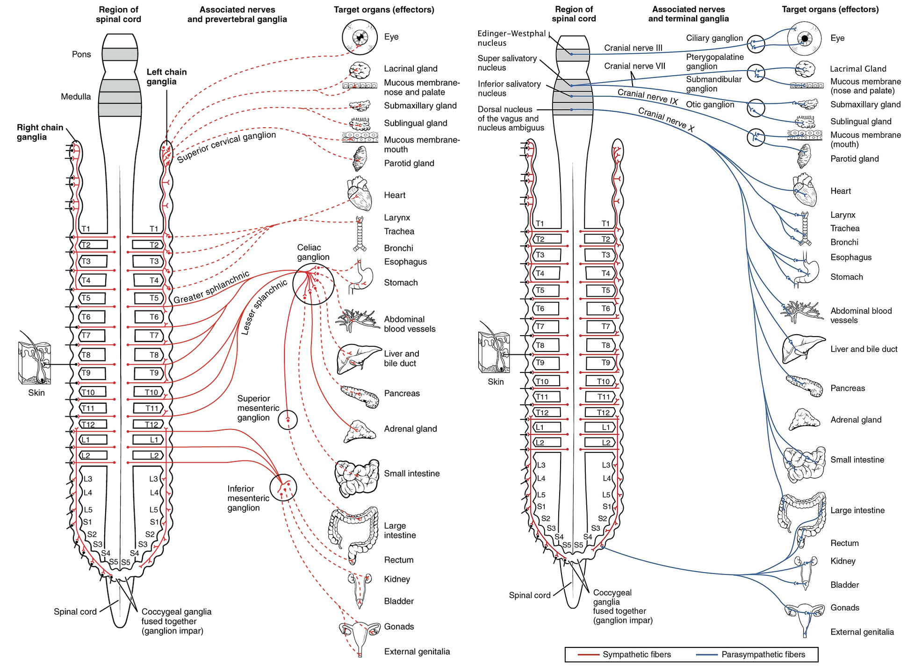
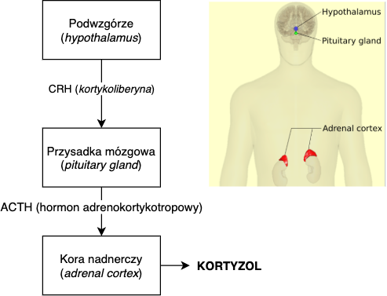
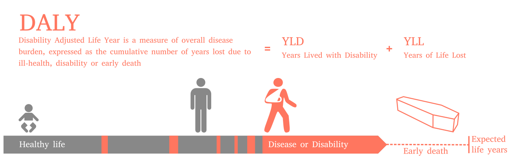
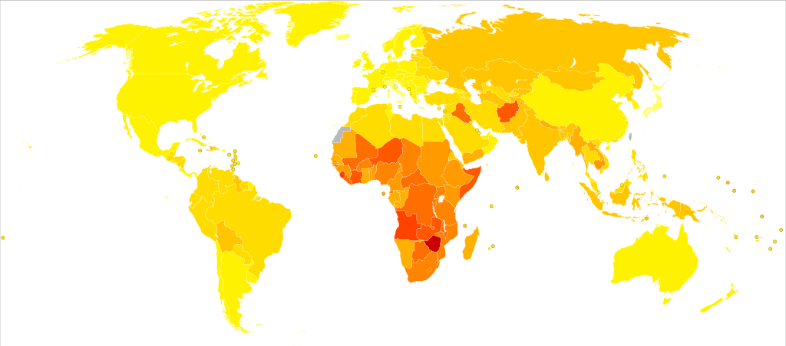
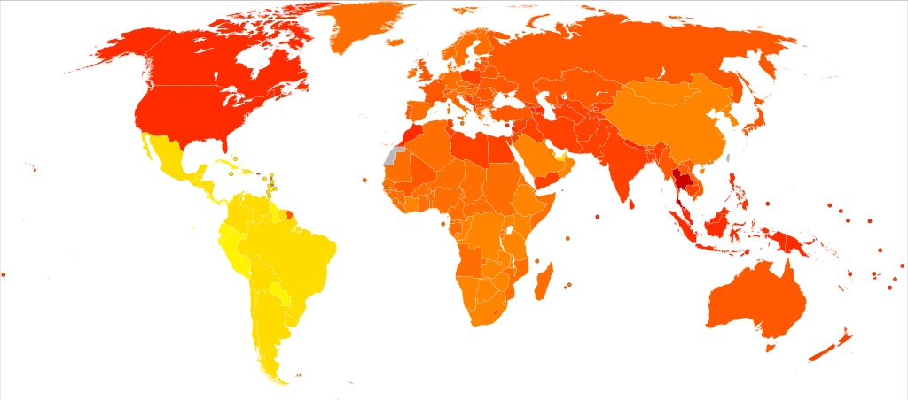

### Stres

- Biologiczny
- Psychologiczny
- ...a może to to samo?

### Stres w biologii

- Stres to odpowiedź organizmu na **stresor**
- Służy odzyskiwaniu allostazy
- Reakcja stresowa jest **uogólniona** (taka sama niezależnie od stresora). Przynajmniej w klasycznej fizjologii stresu (Hans Selye)
- Reakcja wytworzyła się w toku ewolucji

### Dwa "składniki" stresu

- Autonomiczny układ nerwowy (współczulny/przywspółczulny)
- Oś przysadka-podwzgórze-nadnercza (HPA, _hypothalamus-pituitary-adrenal axis_)

### Autonomiczny układ nerwowy

- Część obwodowego układu nerwowego
- Reguluje pracę najważniejszych narządów
- Działanie w dużej części nieświadome
- Układ współczulny (reakcja walki-ucieczki, _fight-or-flight_)
- Układ przywspółczulny (reakcje _feed-and-breed_ i _rest-and-digest_)

---

### HPA (oś przysadka-podwzgórze-nadnercza)

---

### Stres a allostaza

- Reakcja stresowa jest odpowiedzią allostatyczną
- U ludzi: reakcja stresowa w odpowiedzi na **możliwe i prawdopodobne zachwianie homeostazy w przyszłości**
- To wspaniale, że mamy taką zdolność, ale...
- W XXI wieku jest z tym pewien problem

### Dlaczego zebry nie mają wrzodów?

### Dlaczego zebry nie mają wrzodów?

- Zebry **nie** stresują się:
	- kursem Franka i jego wpływem na koszt kredytu hipotecznego
	- utratą pracy
	- globalnym ociepleniem
	- wzrastającą liczbą wypadków na drogach

### Pomyśl

Jak **ostry** stres wpływa na poniższe? Jak **przewlekły stres** wpływa na...
	
1. Układ krążenia
2. Układ trawienny
3. Układ rozrodczy
4. Układ odpornościowy
5. Wzrost i rozwój
6. Mózg

### Układ krążenia

- Zwiększenie tętna
- Zwężenie naczyń krwionośnych
- Więcej krwi = więcej energii do mięśni

### Układ trawienny

- Spowolnienie trawienia
- Suchość w ustach

### Układ rozrodczy

- Zahamowanie sekrecji hormonów płciowych 

### Układ odpornościowy

- Większa aktywacja układu odpornościowego - ochrona przed zakażeniem

### Wzrost i rozwój

- Zahamowanie wydzielania hormonu wzrostu

### Mózg

- Lepsza pamięć
- Bystrzejsza percepcja
- Uwaga przełącza się w tryb czujnościowy

### Radzenie sobie ze stresem. Prężność psychiczna

### Prężność psychiczna

- Ang. _resilience_
- Prężność/sprężystość/odporność psychiczna
- **Stawianie czoła** stresującym zdarzeniom i **dawanie sobie z nimi rady**
- Nie chodzi o unikanie stresu, tylko o radzenie sobie z nim

### Prężność psychiczna

- Patrzenie na pozytywy w trudnych sytuacjach
- Zdolność skutecznego działania w trakcie stresu
- Dobra adaptacja do traumy

### Przeszkody w byciu prężnym psychicznie

- Myślenie o stresie
- Odczuwanie negatywnych emocji
- Lękowość

### Cechy sprzyjające prężności

- Odczuwanie radości i przyjemności
- Wsparcie i integracja społeczna
- Otwartość na doświadczenia
- Poszukiwanie sensowności w życiu
- Porażki jako **szanse** a nie zagrożenia
 

### Kiedy stres uszkadza. Zespół stresu pourazowego (PTSD)

### PTSD - co to takiego?

- PTSD - *(post-traumatic stress distorder)* - zespół stresu pourazowego
- Zaburzenie psychiczne z grupy zaburzeń lękowych
- Powstaje na skutek traumy
- Nowa jednostka chorobowa (od lat 70., po Wietnamie)
- Wcześniej opisywana jako przypadłość żołnierzy (*shell-shock, battle fatigue*)

### Rys kliniczny (wg. *ICD-10*)

Powstaje jako odpowiedź na silnie stresujące zdarzenie lub sytuację (krótko lub długotrwałe) o szczególnie zagrażającej, katastroficznej naturze, które może wywołać silny dystres u prawie każdego.

### Rys kliniczny (wg. *ICD-10*) cd. 

Czynniki ryzyka, takie jak niektóre cechy osobowości (kompulsywność) czy historia chorób o podłożu nerwicowym zwiększają szanse na rozwinięcie się PTSD, ale nie są konieczne.

### Typowe objawy (wg. *ICD-10*)

- Intruzywne myśli odnośnie traumatycznej sytuacji (flashbacks)
- Koszmary senne
- Poczucie stępienia emocjonalnego
- Odseparowanie się od innych ludzi

### Typowe objawy (wg. *ICD-10*)

- Niereagowanie na bodźce ze środowiska
- Anhedonia
- Unikanie aktywności kojarzących się z traumą
- Nadmierne pobudzenie
- „Hiperczujność”
- Bezsenność

### Typowe objawy (wg. *ICD-10*) cd.

- Silny lęk
- Objawy depresyjne
- Myśli samobójcze
- Uzależnienia od alkoholu i narkotyków

### Kryteria diagnostyczne (wg. *ICD-10*)

1. Silnie stresujące wydarzenie wystąpiło max. 6 miesięcy przed pojawieniem się objawów

### Kryteria diagnostyczne (wg. *ICD-10*)

2. Uporczywe przeżywanie stresującego wydarzenia poprzez intruzywne myśli, koszmary senne, bardzo wyraźne wspomnienia lub przeżywanie dystresu w sytuacjach kojarzących się z traumą

### Kryteria diagnostyczne (wg. *ICD-10*)

3. Unikanie sytuacji i bodźców kojarzących się z traumą (które nie występowało wcześniej)

### Kryteria diagnostyczne (wg. *ICD-10*)

4. Brak możliwości przypomnienia sobie części lub całości wydarzenia traumatycznego

lub

5. Trwałe objawy zwiększonej psychicznej wrażliwości i pobudzenia, w tym co najmniej dwa z poniższych:
  + Problemy ze snem
  + Drażliwość i wybuchy gniewu
  + Podwyższona czujność (hyper-vigilance)
  + Przesadna reakcja na przestraszenie (startle response)
  

### Problemy z postawieniem diagnozy

- Objawy muszą wystąpić dopiero **po** traumie (jeśli są wcześniej, diagnoza jest kłopotliwa)
- Podobne objawy w przebiegu depresji, schizofrenii, psychozy spowodowanej środkami psychoaktywnymi, OCD
- Problem symulantów (renty weteranów wojennych w USA)

### Czynniki ryzyka

Doświadczenie traumy:

- żołnierze
- ofiary katastrof
- ofiary gwałtów i napaści
- jeńcy wojenni
  
### Czynniki ryzyka, cd

- Bycie świadkiem traumy (ratownicy medyczni)
- Dzieci do 10 r.ż. - mniejsza szansa wystąpienia PTSD
- Czynniki genetyczne - ok. 30% wariancji (badania na bliźniętach walczących w Wietnamie)
- Neurofizjologia - mniejsza objętość hipokampa

### Metody prewencji PTSD

- Debriefing psychologiczny
- Trauma Risk Management (TRiM)
- Wczesna terapia poznawczo-behawioralna (CBT)

### Metody leczenia PTSD

- Terapia poznawczo-behawioralna skoncentrowana na traumie (TFCBT)
- EMDR - *eye-movement desensitisation and reprocessing*
- Terapie desensytyzacyjne
- Mindfulness
- Terapie behawioralne (3 gen)

### Epidemiologia

Dane amerykańskie:
- 6,8% populacji dotknięta PTSD w którymś momencie życia 
- Mężczyźni 3,6%, kobiety 9,7% 
- U weteranów wojennych wskaźnik rośnie do 30%

### Disability-adjusted life year (DALY)

### DALY dla wszystkich chorób

### DALY dla PTSD

### Epidemiologia PTSD

- Kobiety **DUŻO CZĘŚCIEJ** niż mężczyźni
- W globalnej wariancji DALY dla PTSD udział mężczyzn jest stały (ok. 30 lat na 100 tyś mieszkańców) 
- Za różnice pomiędzy krajami odpowiadają kobiety (od 86 w Tajlandii do 60 w Brazylii)

