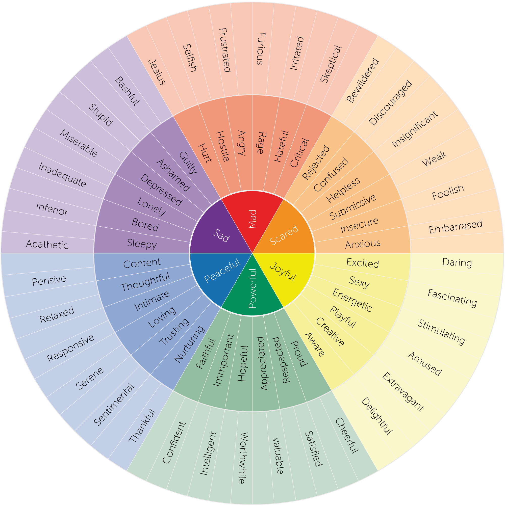

# Informacje organizacyjne

---

# Kontakt

* Aniela Brzezińska
* <anielabrzezinska@gumed.edu.pl>

---

# Plan zajęć

* 15h ćwiczeń
* Poniedziałki 9:30-12:30

---

# Nieobecności

* Obecność na wszystkich laboratoriach jest obowiązkowa
* Starajcie się chodzić na zajęcia swojej przypisanej grupy
* ...ale w ramach odrobienia nieobecności można przyjść na zajęcia innej grupy (po wcześniejszym ustaleniu z prowadzącym)

---

# Zaliczenie laboratoriów

* Proste zaliczenie w formie pisemnej (na ostatnich zajęciach) 
* Do zdobycia 10 punktów

---

# Kilka uwag

* Proszę, żeby na zajęciach nie używać elektroniki - wszystkie materiały będziecie mieli udostępnione
* Będziemy eksplorować swój świat wewnętrzny, w związku z czym
    - gorąco zachęcam do bycia tu i teraz i zaangażowania się w ćwiczenia - dzięki temu będziecie w stanie głębiej zrozumieć koncepty prezentowane na zajęciach
    - zabronione jest wszelkiego rodzaju krytykowanie oraz komentowanie emocji, którymi dzielą się inni studenci
    - bądźmy dla siebie bezpieczni i wyrozumiali
    - na tym przedmiocie zajmujemy się obserwacją, NIE oceną ani diagnozą

---

# Zadanie 1

* Pomyślcie przez chwilę o sytuacji z ostatnich kilku dni, która wywołała u was wyraźną reakcję emocjonalną
* Nie musi być bardzo osobista
* Nie musicie jej nikomu opowiadać
* Nie wybierajcie sytuacji bardzo ciężkich i/lub trudnych - wybierzcie coś, z czym będzie wam komfortowo pracować podczas tych warsztatów

---

* Jaką emocję wtedy czuliście? 
* Zapiszcie to na kartce

---

* Skąd to wiecie?
* Zapiszcie odpowiedź na kartce

---

# Co pomaga nam "odczytać" odczuwane przez nas emocje?

* Sytuacja - co się wydarzyło?
* Ocena - co to dla mnie oznacza? 
* Fizjologia - co dzieje się w ciele?
* Myśli - jakie pojawiają się myśli?
* Doświadczenie - co w przeszłości czuł_m w podobnych sytuacjach?
* Tendencja do działania - co mam ochotę teraz zrobić?
* Wiedza na temat emocji - co statystycznie człowiek może czuć w tej sytuacji?

---

# Zadanie 2

* Podzielcie się dowolnie na pary / trójki i usiądźcie obok siebie
* Każdy osobno przypomina sobie sytuację z początku zajęć
* Zamknijcie oczy i spróbujcie myślami "przenieść się" do tamtej chwili - wyobrazić sobie, że ta sytuacja dzieje się teraz

---

* Przejdźcie uwagą przez głowę, szczękę, szyję, klatkę piersiową, brzuch, ręce, nogi
* Spróbujcie ocenić, czy czujecie coś w ciele:
    - zmianę temperatury
    - ucisk lub rozluźnienie
    - ból lub dyskomfort
* Czy oddech się zmienił?
* Czy mam ochotę coś zrobić, jakoś się ruszyć?
* Czy serce bije inaczej?

---

* Otwórzcie oczy
* Zapiszcie na kartce, co zauważyliście w ciele, bez używania nazw emocji

---

* Przedyskutujcie doświadczenie w swoich grupach, zastanawiając się, jakie emocje mogą być zgodne z profilem opisanym przez was na kartce
---

Czy jedna konfiguracja sygnałów fizjologicznych zawsze wskazuje na konkretny stan emocjonalny?

---

# Pułapka 

"Jeśli czuję w ciele X, to znaczy że odczuwam emocję Y."

---

* Czy łatwo było znaleźć sygnały? Co przeszkadzało w ich odczuwaniu?
* Czy wszyscy zauważyli coś w ciele? Czy ktoś doświadczył trudności w odczuwaniu sygnałów z ciała?
* Czy sygnały były jednoznaczne?
* Czy sygnały pozwoliły Wam nazwać emocję, czy tylko zauważyć, że "coś się dzieje"?

---

# Interocepcja, świadomość interoceptywna

* Umiejętność odczytywania i odczuwania sygnałów wysyłanych z wewnątrz ciała - głód, temperatura, ból, tętno, oddech itp.

---

# Przerwa

---

# Zadanie 3

* Wracamy myślami do tej samej sytuacji 
* Wychodzimy z ciała, wchodzimy do myśli 

---

# Zastanów się

* Co dokładnie się wydarzyło? Suche fakty
* Co pomyślał_m? Jakie pojawiły się myśli?
* Co ta sytuacja dla mnie oznaczała? Jakie nadał_m jej znaczenie?
* Czego się spodziewał_m?
* Co w tej sytuacji było dla mnie zagrożone? Co w tej sytuacji było dla mnie ważne?

---

* Jaką emocję najlepiej opisuje ten zestaw odpowiedzi? 

---

# Appraisal

* Student otrzymuje komunikat: "prowadzący chce ze mną porozmawiać"
* Student A -> "pewnie coś zrobiłem źle" -> lęk
* Student B -> "może chce mnie pochwalić" -> ciekawość/radość
* Student C -> "ugh, śpieszę się na tramwaj!" -> irytacja/zniecierpliwienie

UWAGA: nie oceniamy, który ze studentów ma "właściwe/zdrowe/dobre" myśli. Na tym przedmiocie zajmujemy się obserwacją.

---

# Zadanie 4 

Gdybym nie musiał_ się kontrolować, co zrobił_bym w tej sytuacji? Co mam ochotę zrobić?

---

Przykłady:
* rozpłakać się
* przytulić kogoś
* krzyczeć
* zaatakować
* śmiać się
* zatrzymać się
* zbliżyć się
* uciekać

---

# Przykładowe interpretacje 

| Mam ochotę... | Możliwa emocja  | Co jeszcze mogłoby to oznaczać? |
| ------------- | --------------- | ------------------------------- |
| uciec         | lęk             | wstyd, przeciążenie             |
| zaatakować    | złość           | frustracja, zagrożenie          |
| wycofać się   | smutek          | wstyd, lęk                      |
| podejść       | zainteresowanie | radość, ciekawość               |

---

# Pytanie

Czy tendencja do działania jest tym samym co zachowanie?

---

# Przerwa

---

# Zadanie 5

Które z ćwiczeń dało wam najwięcej informacji o emocjach? Przedyskutujcie w grupie, każdy może mieć inne odczucia!

---

* Czy któraś z dzisiejszych technik była waszym zdaniem "lepsza" niż inna? 
* Czy uważacie, że należałoby używać do identyfikacji emocji jednej techniki, czy wszystkich razem? 
* A może uważacie jeszcze coś innego? 

---

# Granularność emocjonalna (Lisa Feldman Barrett)

Colored Feeling Wheel by Feeling Wheel is licensed under a Creative Commons Attribution-ShareAlike 4.0 International License.

---

# Granularność emocjonalna - dlaczego to ważne?

* Im precyzyjniej zidentyfikujemy odczuwaną emocję, tym precyzyjniejsze możemy zastosować techniki regulacji
* Rozumienie tego, co dzieje się w naszym świecie wewnętrznym zmniejsza ryzyko angażowania się w niezdrowe sposoby regulacji emocji (alkohol, używki, kompulsywne jedzenie) 

Erbas, Y., Gendron, M., & Fugate, J. M. B. (2022). Editorial: The role of emotional granularity in emotional regulation, mental disorders, and well-being. Frontiers in psychology, 13, 1080713. https://doi.org/10.3389/fpsyg.2022.1080713

---

# Zadanie 6

* Do emocji napisanej na samym początku zajęć na kartce, znajdź trzy bardziej precyzyjne alternatywy
* Co zmienia się, kiedy zamiast "czuję się źle" potrafię powiedzieć np. "jestem zawiedziona i rozczarowana"?

---

# Zadanie 7 - c. d. na wykładzie

* Czy można czuć wszystkie te emocje jednocześnie?
* Czy emocje odczuwane jednocześnie muszą wszystkie mieć ten sam charakter?

---

# Na zakończenie

Co sprawia, że mamy czasem wrażenie, że powinniśmy czuć tylko jedną emocję?

---

